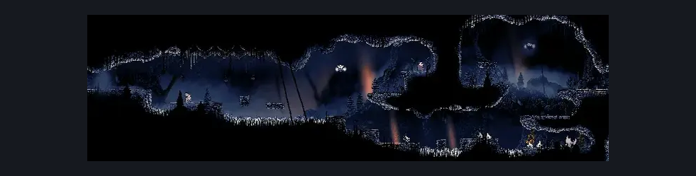
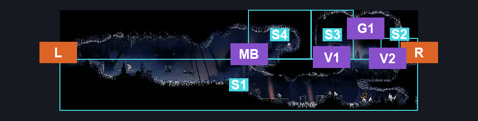
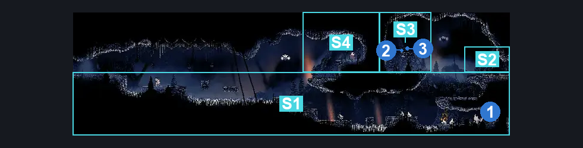

# The Marrow Mr Burns House (Bone_14)

**Game ID:** Bone_14

**Contributors:** herounit

## Subrooms

| No. | Subroom | Annotated |
| --- | --- | --- |
| S1 | ground floor | ✓ |
| S2 | right exit area | ✓ |
| S3 | right upper area | ✓ |
| S4 | mr burns house | ✓ |

## Room Transitions

| Alias | Name | From subroom | Destination | Destination alias | Requirements | TODO | Verification | Annotated | Notes |
| --- | --- | --- | --- | --- | --- | --- | --- | --- | --- |
| L | left | ground floor | [The Marrow Shaft (Bone_03)](the-marrow-shaft.md) | UR | none |  | Verified | ✓ |  |
| R | right | right exit area | [The Marrow Lower Pogo (Bone_07)](the-marrow-lower-pogo.md) | L | none |  | Verified | ✓ |  |

## Subroom Connections

| Alias | Name | Source | Destination | Requirements | TODO | Verification | Annotated | Notes |
| --- | --- | --- | --- | --- | --- | --- | --- | --- |
| V1 | vertical 1 | ground floor | right upper area | silk soar OR ledge grab OR cling grip OR faydown |  | Verified | ✓ | silk soar works here because the jump to the platform below the right exit (and above the big goomba) is tight but can be done without ledge grab, so there is no ceiling interference |
| V1 | vertical 1 | right upper area | ground floor | none (falling) |  | Verified | ✓ |  |
| V2 | vertical 2 | ground floor | right exit area | silk soar OR ledge grab OR cling grip OR faydown |  | Verified | ✓ | silk soar works here because the jump to the platform below the right exit (and above the big goomba) is tight but can be done without ledge grab, so there is no ceiling interference |
| V2 | vertical 2 | right exit area | ground floor | none (falling) |  | Verified | ✓ |  |
| G1 | gap 1 | right exit area | right upper area | run OR dash OR drifters OR faydown OR clawline OR sharpdart OR easy beast pogo |  | Verified | ✓ |  |
| G1 | gap 1 | right upper area | right exit area | run OR dash OR drifters OR faydown OR clawline OR sharpdart OR easy beast pogo |  | Verified | ✓ |  |
| MB | mr burns entry | ground floor | mr burns house | none (tight jump) |  | Verified | ✓ | jump is a tad tight but can be done |
| MB | mr burns entry | mr burns house | ground floor | none (falling) |  | Verified | ✓ |  |

## Check Locations

| No. | Check | Subroom | Requirements | TODO | Verification | Location Type | Annotated | Notes |
| --- | --- | --- | --- | --- | --- | --- | --- | --- |
| 1 | rosary cache the marrow 10 | ground floor | none |  | Verified | collectible | ✓ |  |
| 2 | shell shard cache the marrow 5 | right upper area | none |  | Verified | collectible | ✓ |  |
| 3 | shell shard cache the marrow 6 | right upper area | none |  | Verified | collectible | ✓ |  |

## Room Images

### Scene

### Connections

### Checks

