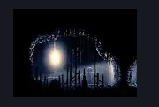
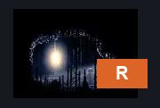

# The Marrow Shaft Side Room (Bone_17)

**Game ID:** Bone_17

**Contributors:** herounit

## Subrooms

No subrooms defined.

## Room Transitions

| Alias | Name | From subroom | Destination | Destination alias | Requirements | TODO | Verification | Annotated | Notes |
| --- | --- | --- | --- | --- | --- | --- | --- | --- | --- |
| R | right |  | [The Marrow Shaft (Bone_03)](the-marrow-shaft.md) | LL | none |  | Verified | ✓ |  |

## Subroom Connections

No subroom connections defined.

## Check Locations

| No. | Check | Subroom | Requirements | TODO | Verification | Location Type | Annotated | Notes |
| --- | --- | --- | --- | --- | --- | --- | --- | --- |
| 1 | shard pendant |  | none |  | Verified | collectible | ✓ |  |

## Room Images

### Scene

### Connections

### Checks

