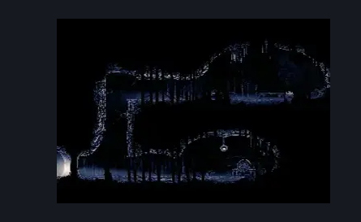
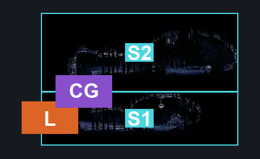
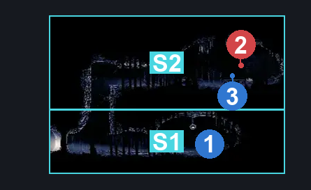

# The Marrow Skull Wall Side Room (Bone_18)

**Game ID:** Bone_18

**Contributors:** herounit

## Subrooms

| No. | Subroom | Annotated |
| --- | --- | --- |
| S1 | lower level | ✓ |
| S2 | upper level | ✓ |

## Room Transitions

| Alias | Name | From subroom | Destination | Destination alias | Requirements | TODO | Verification | Annotated | Notes |
| --- | --- | --- | --- | --- | --- | --- | --- | --- | --- |
| L | left | lower level | [The Marrow Skull Wall (Bone_06)](the-marrow-skull-wall.md) | R | none |  | Verified | ✓ |  |

## Subroom Connections

| Alias | Name | Source | Destination | Requirements | TODO | Verification | Annotated | Notes |
| --- | --- | --- | --- | --- | --- | --- | --- | --- |
| CG | climb | lower level | upper level | cling grip  OR silk soar OR scuttlebrace |  | Verified | ✓ |  |
| CG | climb | upper level | lower level | none (falling) |  | Verified | ✓ |  |

## Check Locations

| No. | Check | Subroom | Requirements | TODO | Verification | Location Type | Annotated | Notes |
| --- | --- | --- | --- | --- | --- | --- | --- | --- |
| 1 | the marrow pilgrim diary | lower level | none |  | Verified | lore | ✓ |  |
| 2 | gauntlet fight | upper level | have cling grip |  | Verified | gauntlet | ✓ |  |
| 3 | the marrow memory locket | upper level | defeat gauntlet fight |  | Verified | collectible | ✓ |  |

## Room Images

### Scene

### Connections

### Checks

