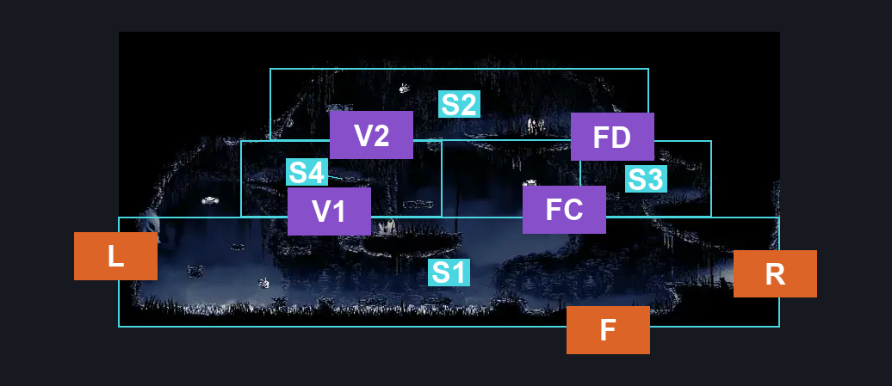
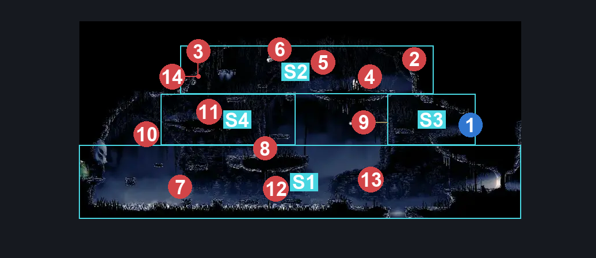
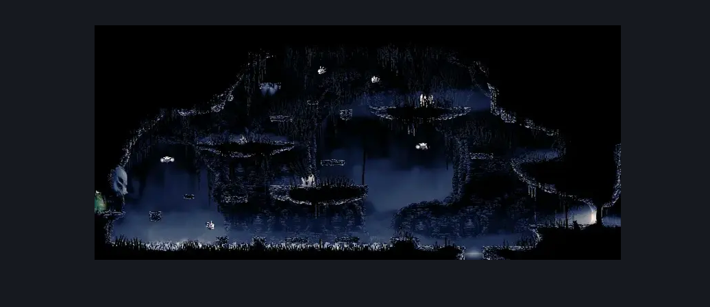

# The Marrow Skull Wall (Bone_06)

**Game ID:** Bone_06

**Contributors:** herounit

## Subrooms

| No. | Subroom | Annotated |
| --- | --- | --- |
| S1 | ground floor | ✓ |
| S2 | upper echelon | ✓ |
| S3 | flea platform | ✓ |
| S4 | middle platform | ✓ |

## Room Transitions

| Alias | Name | From subroom | Destination | Destination alias | Requirements | TODO | Verification | Annotated | Notes |
| --- | --- | --- | --- | --- | --- | --- | --- | --- | --- |
| F | floor | ground floor | [The Marrow Shaft (Bone_03)](the-marrow-shaft.md) | C | none |  | Verified | ✓ |  |
| R | right | ground floor | [The Marrow Skull Wall Side Room (Bone_18)](the-marrow-skull-wall-side-room.md) | L | none |  | Verified | ✓ |  |
| L | left | ground floor | [Greyroots Basement Tall room (Mosstown_03)](../shellwood/greyroots-basement-tall-room.md) | LR | clear blast rock exit blockade IN shellwood diddy basement tall room |  | Verified | ✓ | shellwood |

## Subroom Connections

| Alias | Name | Source | Destination | Requirements | TODO | Verification | Annotated | Notes |
| --- | --- | --- | --- | --- | --- | --- | --- | --- |
| V1 | vertical 1 | ground floor | middle platform | ledge grab OR easy enemy pogo OR easy shaman pogo OR faydown OR cling grip OR silk soar |  | Verified | ✓ |  |
| V1 | vertical 1 | middle platform | ground floor | none (falling) |  | Verified | ✓ |  |
| V2 | vertical 2 | middle platform | upper echelon | ledge grab OR easy enemy pogo OR easy shaman pogo OR faydown OR cling grip OR silk soar |  | Verified | ✓ |  |
| V2 | vertical 2 | upper echelon | middle platform | none (falling) |  | Verified | ✓ |  |
| FD | flea drop | flea platform | upper echelon | silk soar OR ( ledge grab AND faydown ) |  | Verified | ✓ |  |
| FD | flea drop | upper echelon | flea platform | none (falling) |  | Verified | ✓ |  |
| FC | flea crossing | ground floor | flea platform | silk soar OR ( clawline AND easy enemy pogo ) |  | Verified | ✓ | can clawline across this gap with the help of a very cooperative enemy |
| FC | flea crossing | flea platform | ground floor | none (falling) |  | Verified | ✓ |  |

## Check Locations

| No. | Check | Subroom | Requirements | TODO | Verification | Location Type | Annotated | Notes |
| --- | --- | --- | --- | --- | --- | --- | --- | --- |
| 1 | flea the marrow | flea platform | break vines right |  | Verified | collectible | ✓ |  |
| 2 | Volatile Flintbeetle 2 | upper echelon | complete THE volatile flintbeetles wish promised |  | Verified | miniboss | ✓ | this one swaps position based on when the marrow bellshrine is activated (per the wiki) - best to ensure both locations are accessible for the quest |
| 3 | Shell Fossil Mimic | upper echelon | attack up |  | Verified | miniboss | ✓ |  |
| 4 | Skull Brute 1 | upper echelon | none |  | Verified | enemy | ✓ |  |
| 5 | Beastfly 1 | upper echelon | none |  | Verified | enemy | ✓ |  |
| 6 | Beastfly 2 | upper echelon | none |  | Verified | enemy | ✓ |  |
| 7 | Beastfly 3 | ground floor | none |  | Verified | enemy | ✓ |  |
| 8 | Skull Brute 2 | ground floor | none |  | Verified | enemy | ✓ |  |
| 9 | Caranid 1 | flea platform | none |  | Verified | enemy | ✓ |  |
| 10 | Caranid 2 | ground floor | none |  | Verified | enemy | ✓ | can reach from the ground floor |
| 11 | Skull Scuttler 1 | middle platform | none |  | Verified | enemy | ✓ |  |
| 12 | Caranid 3 | ground floor | Normal World Spawn |  | Verified | enemy | ✓ |  |
| 13 | Caranid 4 | ground floor | Black Thread World Spawn |  | Verified | enemy | ✓ |  |
| 14 | Shardillard 1 | upper echelon | none |  | Verified | enemy | ✓ |  |

## Room Images

### Connections

### Checks

### Scene

