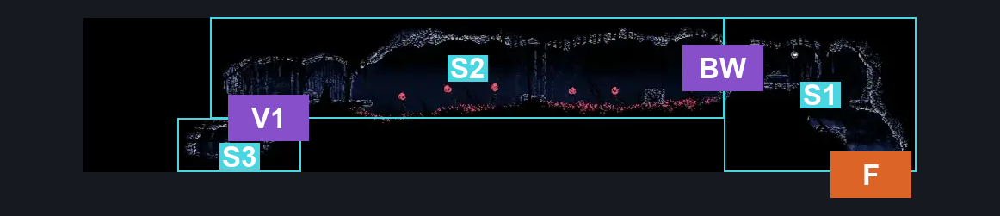
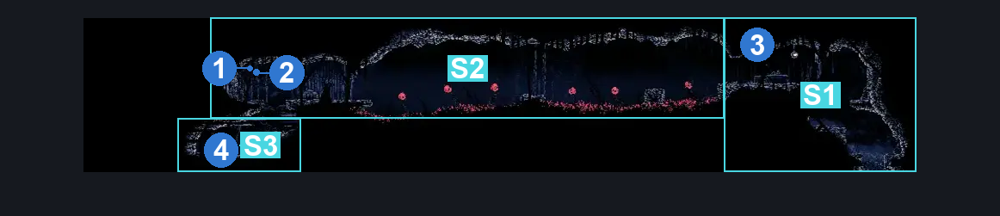
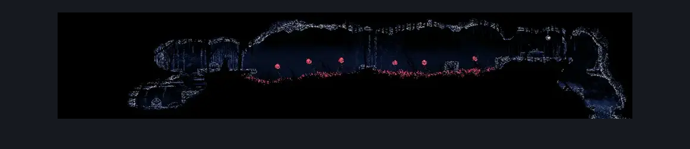

# The Marrow Upper Pogo (Bone_19)

**Game ID:** Bone_19

**Contributors:** herounit

## Subrooms

| No. | Subroom | Annotated |
| --- | --- | --- |
| S1 | entrance | ✓ |
| S2 | pogo land | ✓ |
| S3 | chest area | ✓ |

## Room Transitions

| Alias | Name | From subroom | Destination | Destination alias | Requirements | TODO | Verification | Annotated | Notes |
| --- | --- | --- | --- | --- | --- | --- | --- | --- | --- |
| F | floor | entrance | [The Marrow Lower Pogo (Bone_07)](the-marrow-lower-pogo.md) | C | none |  | Verified | ✓ |  |

## Subroom Connections

| Alias | Name | Source | Destination | Requirements | TODO | Verification | Annotated | Notes |
| --- | --- | --- | --- | --- | --- | --- | --- | --- |
| BW | break wall | entrance | pogo land | break wall left |  | Verified | ✓ |  |
| BW | break wall | pogo land | entrance | break wall right |  | Verified | ✓ |  |
| V1 | vertical 1 | chest area | pogo land | ledge grab OR silk soar OR cling grip OR faydown |  | Verified | ✓ |  |
| V1 | vertical 1 | pogo land | chest area | none (falling) |  | Verified | ✓ |  |

## Check Locations

| No. | Check | Subroom | Requirements | TODO | Verification | Location Type | Annotated | Notes |
| --- | --- | --- | --- | --- | --- | --- | --- | --- |
| 1 | rosary cache the marrow 14 | pogo land | none |  | Verified | collectible | ✓ |  |
| 2 | rosary cache the marrow 15 | pogo land | none |  | Verified | collectible | ✓ |  |
| 3 | rosary cache the marrow 16 | entrance | none |  | Verified | collectible | ✓ |  |
| 4 | the marrow upper pogo rosary chest | chest area | none |  | Verified | collectible | ✓ | NOT RANDOMIZED YET |

## Room Images

### Connections

### Checks

### Scene

