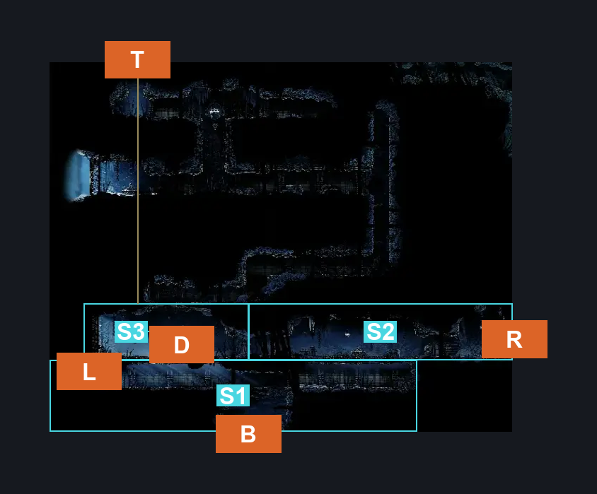
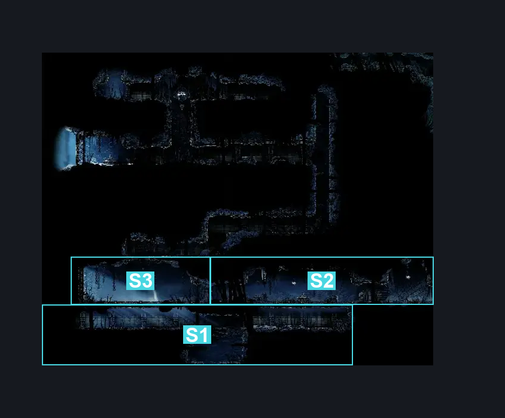
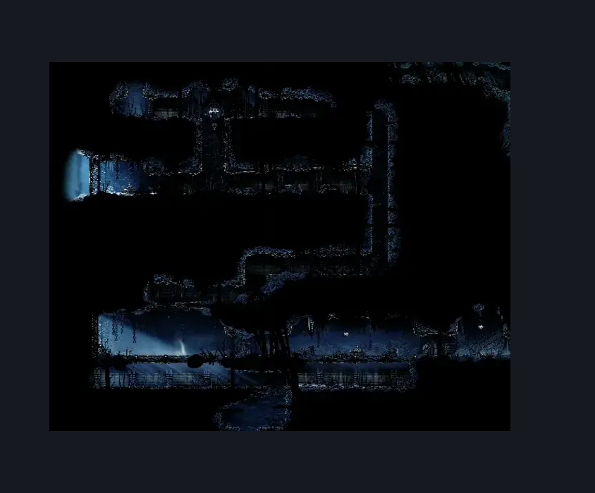

# Slab Arena (Slab_16)

**Game ID:** Slab_16

## Subrooms

| No. | Subroom | Annotated |
| --- | --- | --- |
| S1 | Bottom Tunnel | ✓ |
| S2 | Right Entrance | ✓ |
| S3 | Arena | ✓ |

## Room Transitions

| Alias | Name | From subroom | Destination | Destination alias | Requirements | TODO | Verification | Annotated | Notes |
| --- | --- | --- | --- | --- | --- | --- | --- | --- | --- |
| D | door1 | Arena | [Slab Broodmother Alcove](slab-broodmother-alcove.md) | U | complete THE The Wailing Mother Wish Promised |  | Needs verification | ✓ | need the room mapped |
| B | bot1 | Bottom Tunnel | [Slab Chilly Prison (Slab_15)](slab-chilly-prison.md) | T | none |  |  | ✓ |  |
| L | left1 | Bottom Tunnel | [Mount Fay Entrance (Peak_01)](../mount-fay/mount-fay-entrance.md) | USR | cling grip |  |  | ✓ | Naked. |
| T | top1 | Arena | [Slab Chilly Top (Slab_22)](slab-chilly-top.md) | BL | cling grip OR silk soar |  |  | ✓ | Naked |
| R | right1 | Right Entrance | [Slab Cell (Slab_03)](slab-cell.md) | L0L | none |  |  | ✓ |  |

## Subroom Connections

| Alias | Name | Source | Destination | Requirements | TODO | Verification | Annotated | Notes |
| --- | --- | --- | --- | --- | --- | --- | --- | --- |
| A | Arena | Arena | Right Entrance | have Key of Heretic |  |  |  |  |
| A | Arena | Right Entrance | Arena | have Key of Heretic |  |  |  |  |

## Check Locations

| No. | Check | Subroom | Requirements | TODO | Verification | Location Type | Annotated | Notes |
| --- | --- | --- | --- | --- | --- | --- | --- | --- |
| 1 | Key of Heretic | Arena | defeat gauntlet fight |  |  | collectible |  |  |
| 2 | Gauntlet Fight | Arena | none |  |  | gauntlet |  |  |
| 3 | The Wailing Mother Wish Broodmother Alcove Trigger | Arena | none |  | Verified | logic-point |  |  |

## Room Images

### Connections

### Checks

### Scene

