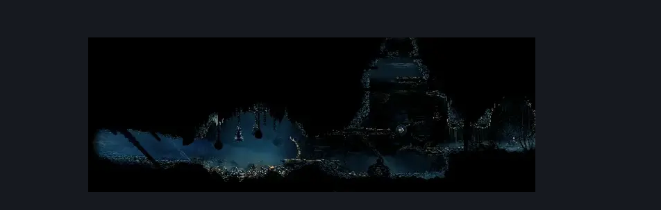

# Slab Bellway (Slab_06)

**Game ID:** Slab_06

## Subrooms

No subrooms defined.

## Room Transitions

| Alias | Name | From subroom | Destination | Destination alias | Requirements | TODO | Verification | Annotated | Notes |
| --- | --- | --- | --- | --- | --- | --- | --- | --- | --- |
| T | top1 |  | [Slab Infleatween Bottom (Slab_05)](slab-infleatween-bottom.md) | B | Cling Grip OR Silk Soar OR Scuttlebrace OR (Faydown AND ((Proficient Movement AND Ledge Grab) OR (Flea Brew) OR (Easy Heal Stall OR Easy Flea Brew Stall) OR (Easy Shaman Crest Pogo))) |  | Verified | ✓ |  |
| NI | door1 |  | TODO |  |  | TODO |  | ✓ | Not implemented as far as I know |
| L | left1 |  | [Mount Fay Entrance (Peak_01)](../mount-fay/mount-fay-entrance.md) | LR | none | TODO |  | ✓ | To Peaks_01 |
| BW | door_fastTravelExit |  | [Bellway Menu](../fast-travel/bellway-menu.md) | TS | Unlock Bellway The Slab |  |  | ✓ |  |

## Subroom Connections

No subroom connections defined.

## Check Locations

| No. | Check | Subroom | Requirements | TODO | Verification | Location Type | Annotated | Notes |
| --- | --- | --- | --- | --- | --- | --- | --- | --- |
| 1 | Flea: The Slab - Bellway |  | (cling grip AND faydown) OR silk soar |  |  | collectible |  |  |
| 2 | Bellway The Slab |  | Unlock Bellway Rosary Lock |  |  | travel |  |  |
| 3 | Bellway Rosary Lock |  | spend 40 rosaries |  |  | lock |  |  |
| 4 | Drapefly 1 |  |  |  |  | enemy | ✓ |  |

## Room Images

### Connections

### Checks

### Scene

