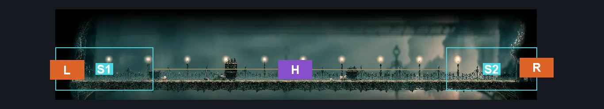
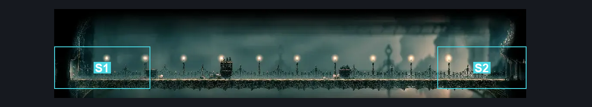
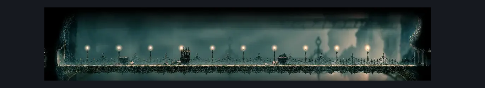

# Slab Bridge (Slab_01)

**Game ID:** Slab_01

**Contributors:** samupo

## Subrooms

| No. | Subroom | Annotated |
| --- | --- | --- |
| S1 | Left | ✓ |
| S2 | Right | ✓ |

## Room Transitions

| Alias | Name | From subroom | Destination | Destination alias | Requirements | TODO | Verification | Annotated | Notes |
| --- | --- | --- | --- | --- | --- | --- | --- | --- | --- |
| L | left1 | Left | [Slab Entrance (Slab_02)](slab-entrance.md) | R | none |  |  | ✓ |  |
| R | right1 | Right | [Choral Chambers Outside Spa (Song_04)](../choral-chambers/choral-chambers-outside-spa.md) | L | none |  |  | ✓ |  |

## Subroom Connections

| Alias | Name | Source | Destination | Requirements | TODO | Verification | Annotated | Notes |
| --- | --- | --- | --- | --- | --- | --- | --- | --- |
| H | Horizontal | Left | Right | cling grip OR ledge grab OR faydown cloak OR clawline |  | Verified | ✓ | You can jump off of the left obstacle and use clawline twice, this cannot be done from the other side |
| H | Horizontal | Right | Left | cling grip OR ledge grab OR faydown cloak |  | Verified | ✓ |  |

## Check Locations

| No. | Check | Subroom | Requirements | TODO | Verification | Location Type | Annotated | Notes |
| --- | --- | --- | --- | --- | --- | --- | --- | --- |
| 1 | import enemies |  |  | TODO | Needs verification |  |  |  |

## Room Images

### Connections

### Checks

### Scene

