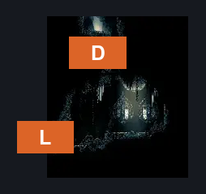
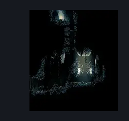

# Slab Cave Entrance (Slab_08)

**Game ID:** Slab_08

## Subrooms

No subrooms defined.

## Room Transitions

| Alias | Name | From subroom | Destination | Destination alias | Requirements | TODO | Verification | Annotated | Notes |
| --- | --- | --- | --- | --- | --- | --- | --- | --- | --- |
| D | door1 |  | [Slab Quiet Cell (Slab_Cell_Quiet)](slab-quiet-cell.md) | B | (faydown AND cling grip) OR silk soar |  |  | ✓ |  |
| L | left1 |  | [Slab Cell (Slab_03)](slab-cell.md) | L5R | have Key of Heretic |  |  | ✓ |  |

## Subroom Connections

No subroom connections defined.

## Check Locations

| No. | Check | Subroom | Requirements | TODO | Verification | Location Type | Annotated | Notes |
| --- | --- | --- | --- | --- | --- | --- | --- | --- |
| 1 | The Slab - Left Orders |  | none |  |  | lore |  |  |
| 2 | The Slab - Right Orders |  | none |  |  | lore |  |  |
| 3 | import enemies |  |  | TODO | Needs verification |  |  |  |

## Room Images

### Connections

### Checks

### Scene

