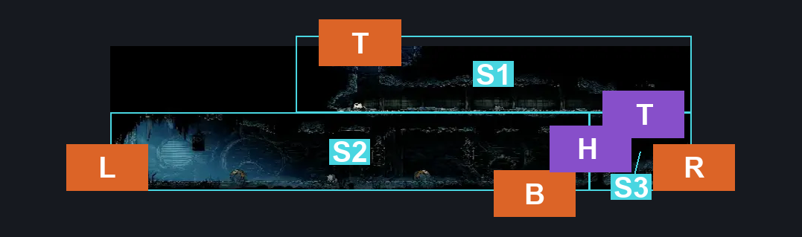
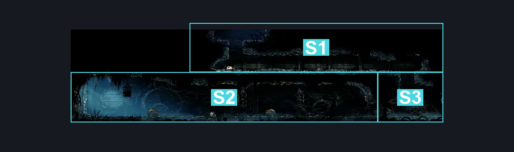

# Slab Chilly Prison (Slab_15)

**Game ID:** Slab_15

## Subrooms

| No. | Subroom | Annotated |
| --- | --- | --- |
| S1 | Top | ✓ |
| S2 | Left | ✓ |
| S3 | Right | ✓ |

## Room Transitions

| Alias | Name | From subroom | Destination | Destination alias | Requirements | TODO | Verification | Annotated | Notes |
| --- | --- | --- | --- | --- | --- | --- | --- | --- | --- |
| L | left1 | Left | [Mount Fay Entrance (Peak_01)](../mount-fay/mount-fay-entrance.md) | MSR | none |  |  | ✓ |  |
| B | bot1 | Left | [Slab Indolent Room (Slab_14)](slab-indolent-room.md) | T | none |  |  | ✓ |  |
| T | top1 | Top | [Slab Arena (Slab_16)](slab-arena.md) | B | cling grip |  |  | ✓ | Naked |
| R | right1 | Right | [Slab Cell (Slab_03)](slab-cell.md) | L1L | none |  |  | ✓ |  |

## Subroom Connections

| Alias | Name | Source | Destination | Requirements | TODO | Verification | Annotated | Notes |
| --- | --- | --- | --- | --- | --- | --- | --- | --- |
| H | Indolent Key | Left | Right | have Key of Indolent |  |  | ✓ | Naked |
| H | Indolent Key | Right | Left | have Key of Indolent |  |  | ✓ |  |
| T | Top | Right | Top | cling grip |  |  | ✓ | Naked |
| T | Top | Top | Right | none |  |  | ✓ | falling |

## Check Locations

| No. | Check | Subroom | Requirements | TODO | Verification | Location Type | Annotated | Notes |
| --- | --- | --- | --- | --- | --- | --- | --- | --- |
| 1 | import enemies |  |  | TODO | Needs verification |  |  |  |

## Room Images

### Connections

### Checks

### Scene

