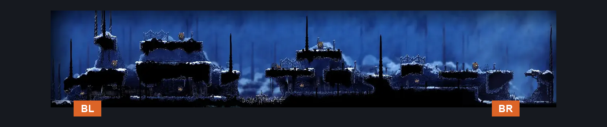
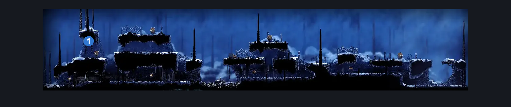
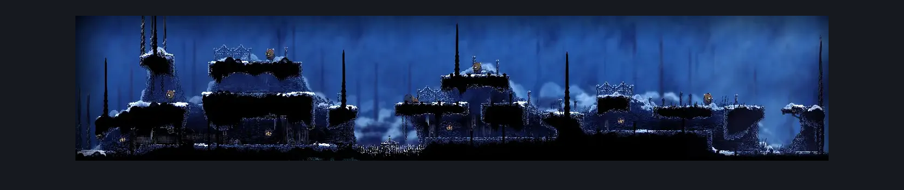

# Slab Chilly Top (Slab_22)

**Game ID:** Slab_22

## Subrooms

No subrooms defined.

## Room Transitions

| Alias | Name | From subroom | Destination | Destination alias | Requirements | TODO | Verification | Annotated | Notes |
| --- | --- | --- | --- | --- | --- | --- | --- | --- | --- |
| BL | bot1 |  | [Slab Arena (Slab_16)](slab-arena.md) | T | cling grip AND dash |  |  | ✓ | Naked |
| BR | bot2 |  | [Slab Shaft (Slab_21)](slab-shaft.md) | T | dash AND (cling grip OR ledge grab) |  |  | ✓ | Naked |

## Subroom Connections

No subroom connections defined.

## Check Locations

| No. | Check | Subroom | Requirements | TODO | Verification | Location Type | Annotated | Notes |
| --- | --- | --- | --- | --- | --- | --- | --- | --- |
| 1 | The Slab - Frayed Rosary String #3 |  | cling grip AND dash |  |  | collectible | ✓ | Naked |
| 2 | import enemies |  |  | TODO | Needs verification |  |  |  |

## Room Images

### Connections

### Checks

### Scene

