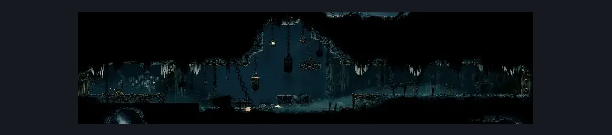
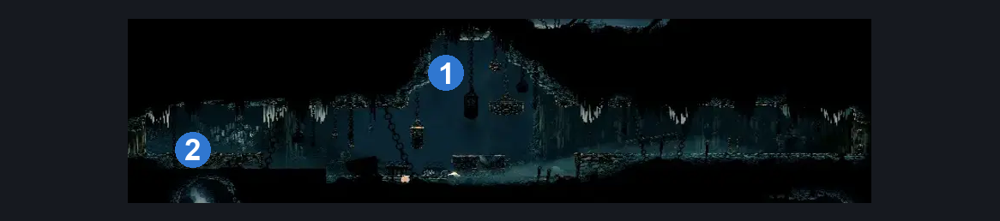

# Slab Entrance (Slab_02)

**Game ID:** Slab_02

## Subrooms

No subrooms defined.

## Room Transitions

| Alias | Name | From subroom | Destination | Destination alias | Requirements | TODO | Verification | Annotated | Notes |
| --- | --- | --- | --- | --- | --- | --- | --- | --- | --- |
| L | left1 |  | [Slab Cell (Slab_03)](slab-cell.md) | L4R | activate slab entrance switch |  |  | ✓ |  |
| R | right1 |  | [Slab Bridge (Slab_01)](slab-bridge.md) | L | none |  |  | ✓ |  |

## Subroom Connections

No subroom connections defined.

## Check Locations

| No. | Check | Subroom | Requirements | TODO | Verification | Location Type | Annotated | Notes |
| --- | --- | --- | --- | --- | --- | --- | --- | --- |
| 1 | The Slab - Frayed Rosary String #1 |  | none |  |  | collectible | ✓ |  |
| 2 | Slab Entrance Switch |  | flip switch down |  |  | switch | ✓ |  |

## Room Images

### Scene

### Connections

### Checks

