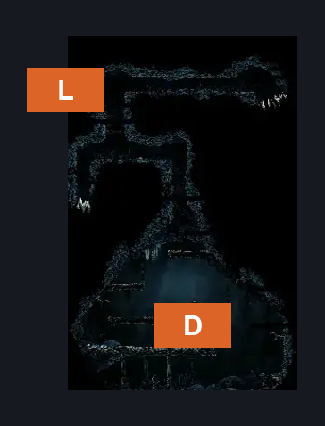
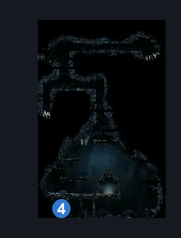
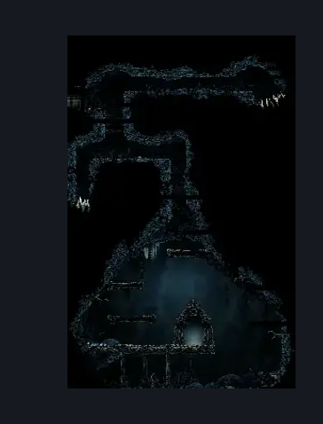

# Slab First Sinner Antechamber (Slab_10c)

**Game ID:** Slab_10c

**Contributors:** samupo

## Subrooms

No subrooms defined.

## Room Transitions

| Alias | Name | From subroom | Destination | Destination alias | Requirements | TODO | Verification | Annotated | Notes |
| --- | --- | --- | --- | --- | --- | --- | --- | --- | --- |
| L | left1 |  | [Slab Prelude (Slab_19b)](slab-prelude.md) | R | cling grip |  |  | ✓ |  |
| D | door1 |  | TODO |  | none |  |  | ✓ | First Sinner boss fight |

## Subroom Connections

No subroom connections defined.

## Check Locations

| No. | Check | Subroom | Requirements | TODO | Verification | Location Type | Annotated | Notes |
| --- | --- | --- | --- | --- | --- | --- | --- | --- |
| 1 | The Slab - Weaver Gate Inscription |  | faydown |  |  | lore |  |  |
| 2 | Rune Rage |  | defeat Boss: First Sinner |  |  | collectible |  |  |
| 3 | Boss: First Sinner |  | faydown |  |  | boss |  |  |
| 4 | Mister Mushroom Meeting The Slab |  | after THE Mister Mushroom Meeting Greymoor AND Needolin |  | Verified | event | ✓ |  |

## Room Images

### Connections

### Checks

### Scene

