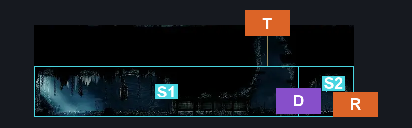
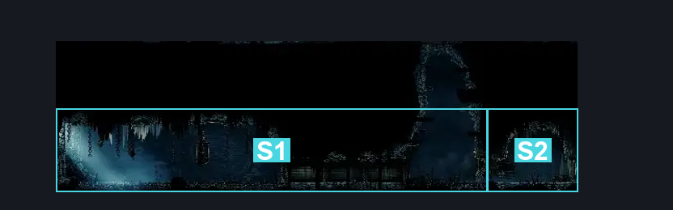
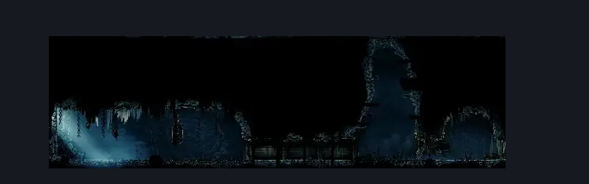

# Slab Indolent Room (Slab_14)

**Game ID:** Slab_14

## Subrooms

| No. | Subroom | Annotated |
| --- | --- | --- |
| S1 | Left | ✓ |
| S2 | Right | ✓ |

## Room Transitions

| Alias | Name | From subroom | Destination | Destination alias | Requirements | TODO | Verification | Annotated | Notes |
| --- | --- | --- | --- | --- | --- | --- | --- | --- | --- |
| T | top1 | Left | [Slab Chilly Prison (Slab_15)](slab-chilly-prison.md) | B | silk soar |  |  | ✓ |  |
| R | right1 | Right | [Slab Cell (Slab_03)](slab-cell.md) | L2L | none |  |  | ✓ |  |

## Subroom Connections

| Alias | Name | Source | Destination | Requirements | TODO | Verification | Annotated | Notes |
| --- | --- | --- | --- | --- | --- | --- | --- | --- |
| D | Indolent Door | Left | Right | have Key of Indolent |  |  | ✓ |  |

## Check Locations

| No. | Check | Subroom | Requirements | TODO | Verification | Location Type | Annotated | Notes |
| --- | --- | --- | --- | --- | --- | --- | --- | --- |
| 1 | Indolent Key | Left | none |  |  | collectible |  | Not randomized |
| 2 | import enemies |  |  | TODO | Needs verification |  |  |  |

## Room Images

### Connections

### Checks

### Scene

