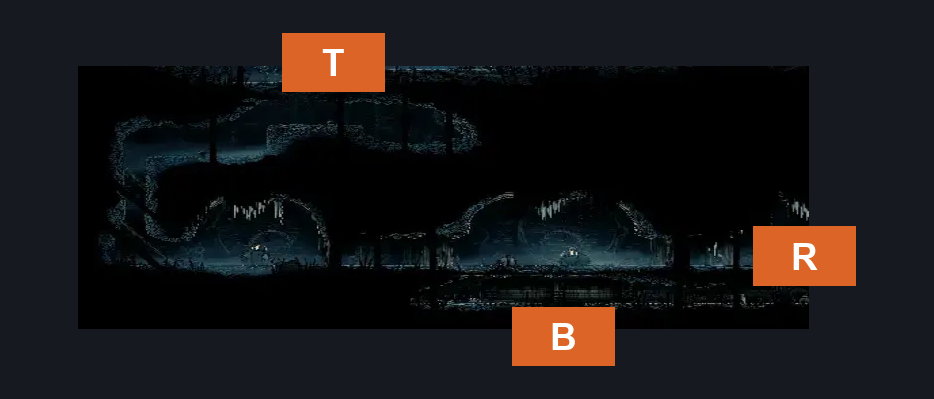
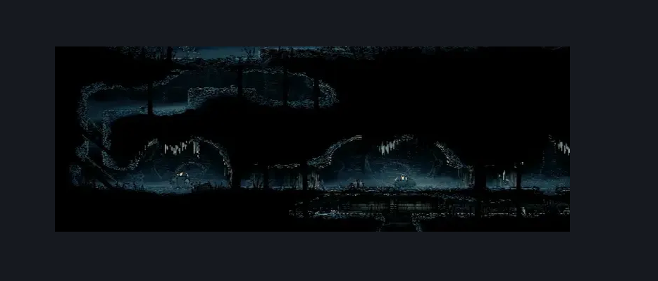

# Slab Infleatween Bottom (Slab_05)

**Game ID:** Slab_05

## Subrooms

| No. | Subroom | Annotated |
| --- | --- | --- |
| S1 | Top |  |
| S2 | Bottom |  |
| S3 | Mid |  |

## Room Transitions

| Alias | Name | From subroom | Destination | Destination alias | Requirements | TODO | Verification | Annotated | Notes |
| --- | --- | --- | --- | --- | --- | --- | --- | --- | --- |
| B | bot1 | Bottom | [Slab Bellway (Slab_06)](slab-bellway.md) | T | none |  |  | ✓ |  |
| T | top1 | Top | [Slab Infleatween Top (Slab_04)](slab-infleatween-top.md) | B | none |  |  | ✓ |  |
| R | right1 | Mid | [Slab Cell (Slab_03)](slab-cell.md) | L5L | have Key of Apostate |  |  | ✓ |  |

## Subroom Connections

| Alias | Name | Source | Destination | Requirements | TODO | Verification | Annotated | Notes |
| --- | --- | --- | --- | --- | --- | --- | --- | --- |
| V | Vertical | Mid | Top | cling grip OR silk soar |  |  |  |  |
| V | Vertical | Top | Mid | none |  |  |  | falling |
| V2 | Vertical 2 | Mid | Bottom | none |  |  |  | falling |
| V2 | Vertical 2 | Bottom | Mid | ledge grab OR faydown OR silk soar |  |  |  |  |

## Check Locations

| No. | Check | Subroom | Requirements | TODO | Verification | Location Type | Annotated | Notes |
| --- | --- | --- | --- | --- | --- | --- | --- | --- |
| 1 | The Slab - Shell Shard Cache #1 | Top | none |  |  | collectible |  |  |
| 2 | The Slab - Shell Shard Cache #2 | Top | none |  |  | collectible |  |  |
| 3 | The Slab - Shell Shard Cache #3 | Top | none |  |  | collectible |  |  |
| 4 | import enemies |  |  | TODO | Needs verification |  |  |  |

## Room Images

### Connections

### Checks

### Scene

