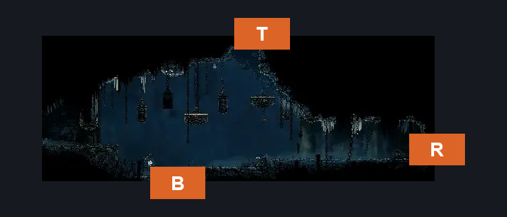
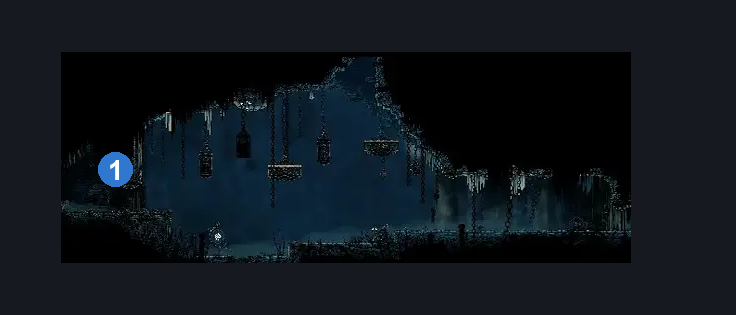
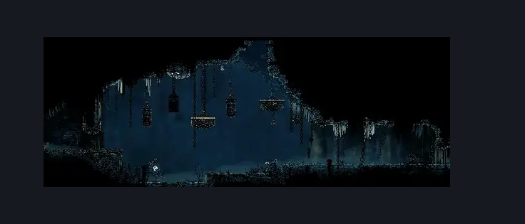

# Slab Infleatween Top (Slab_04)

**Game ID:** Slab_04

## Subrooms

No subrooms defined.

## Room Transitions

| Alias | Name | From subroom | Destination | Destination alias | Requirements | TODO | Verification | Annotated | Notes |
| --- | --- | --- | --- | --- | --- | --- | --- | --- | --- |
| R | right1 |  | [Slab Cell (Slab_03)](slab-cell.md) | L4L | none |  |  | ✓ |  |
| T | top1 |  | [Slab Flea Prison (Slab_13)](slab-flea-prison.md) | B | (cling grip AND (ledge grab OR dash)) OR silk soar |  |  | ✓ |  |
| B | bot1 |  | [Slab Infleatween Bottom (Slab_05)](slab-infleatween-bottom.md) | T | none |  |  | ✓ |  |

## Subroom Connections

No subroom connections defined.

## Check Locations

| No. | Check | Subroom | Requirements | TODO | Verification | Location Type | Annotated | Notes |
| --- | --- | --- | --- | --- | --- | --- | --- | --- |
| 1 | The Slab - Shard Bundle |  | ledge grab OR cling grip OR clawline OR faydown |  |  | collectible | ✓ |  |

## Room Images

### Connections

### Checks

### Scene

