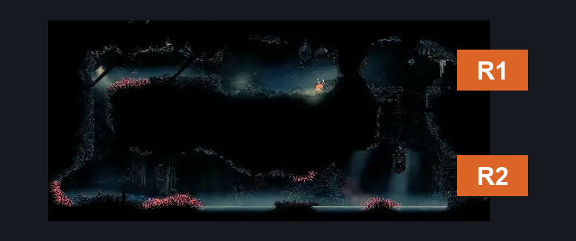
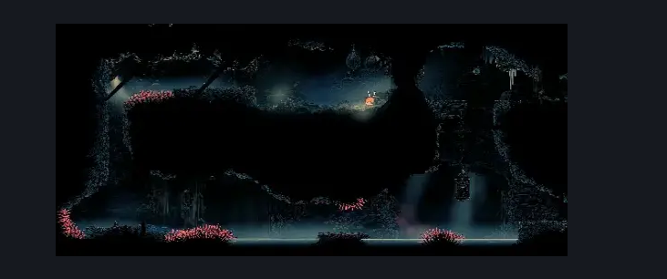

# Slab Poodle (Slab_07)

**Game ID:** Slab_07

## Subrooms

No subrooms defined.

## Room Transitions

| Alias | Name | From subroom | Destination | Destination alias | Requirements | TODO | Verification | Annotated | Notes |
| --- | --- | --- | --- | --- | --- | --- | --- | --- | --- |
| R1 | right1 |  | [Slab Cell (Slab_03)](slab-cell.md) | L7L | swim AND faydown AND clawline AND cling grip AND clear Exit Breakable Wall Blockade |  |  | ✓ |  |
| R2 | right2 |  | [Slab Cell (Slab_03)](slab-cell.md) | L8L | swim |  |  | ✓ |  |

## Subroom Connections

No subroom connections defined.

## Check Locations

| No. | Check | Subroom | Requirements | TODO | Verification | Location Type | Annotated | Notes |
| --- | --- | --- | --- | --- | --- | --- | --- | --- |
| 1 | Exit Breakable Wall Blockade |  | break wall right |  |  | blockade |  |  |

## Room Images

### Connections

### Checks

### Scene

