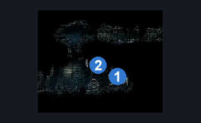
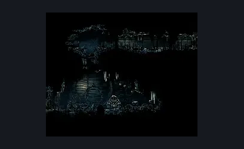

# Slab Prelude (Slab_19b)

**Game ID:** Slab_19b

## Subrooms

No subrooms defined.

## Room Transitions

| Alias | Name | From subroom | Destination | Destination alias | Requirements | TODO | Verification | Annotated | Notes |
| --- | --- | --- | --- | --- | --- | --- | --- | --- | --- |
| L | left1 |  | [Slab Cell (Slab_03)](slab-cell.md) | L6R | have Key of Heretic |  |  | ✓ |  |
| R | right1 |  | [Slab First Sinner Antechamber (Slab_10c)](slab-first-sinner-antechamber.md) | L | (faydown AND cling grip) OR silk soar |  |  | ✓ |  |

## Subroom Connections

No subroom connections defined.

## Check Locations

| No. | Check | Subroom | Requirements | TODO | Verification | Location Type | Annotated | Notes |
| --- | --- | --- | --- | --- | --- | --- | --- | --- |
| 1 | The Slab - Rosary Chest |  | none |  |  | collectible | ✓ |  |
| 2 | The Slab - Rosary Cache #2 |  | none |  |  | collectible | ✓ |  |
| 3 | The Slab - Rosary Cache #3 |  | none |  |  | collectible |  |  |
| 4 | The Slab - Rosary Cache #4 |  | none |  |  | collectible |  |  |
| 5 | The Slab - Rosary Cache #5 |  | none |  |  | collectible |  |  |

## Room Images

### Connections

### Checks

### Scene

