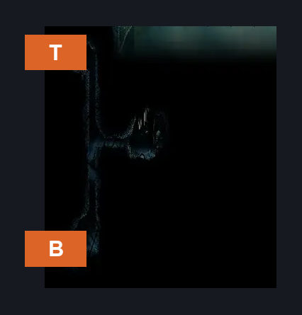
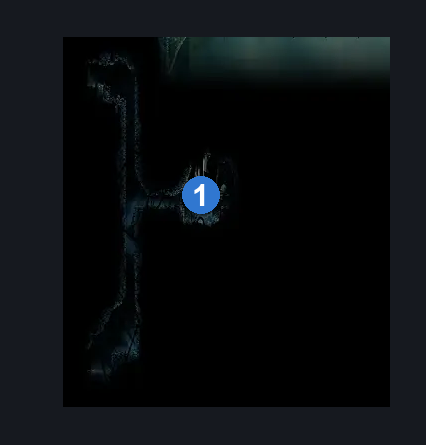
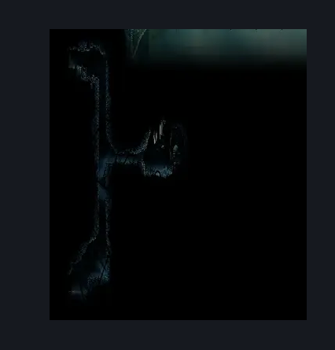

# Slab Quiet Cell (Slab_Cell_Quiet)

**Game ID:** Slab_Cell_Quiet

## Subrooms

| No. | Subroom | Annotated |
| --- | --- | --- |
| S1 | Top |  |
| S2 | Bottom |  |

## Room Transitions

| Alias | Name | From subroom | Destination | Destination alias | Requirements | TODO | Verification | Annotated | Notes |
| --- | --- | --- | --- | --- | --- | --- | --- | --- | --- |
| T | left1 | Top | [Slab Cavern Exit (Slab_23)](slab-cavern-exit.md) | D2 | none |  |  | ✓ |  |
| B | left2 | Bottom | [Slab Cave Entrance (Slab_08)](slab-cave-entrance.md) | D | none |  |  | ✓ |  |

## Subroom Connections

| Alias | Name | Source | Destination | Requirements | TODO | Verification | Annotated | Notes |
| --- | --- | --- | --- | --- | --- | --- | --- | --- |
| V | Vertical | Bottom | Top | cling grip OR silk soar |  |  |  |  |
| V | Vertical | Top | Bottom | none |  |  |  |  |

## Check Locations

| No. | Check | Subroom | Requirements | TODO | Verification | Location Type | Annotated | Notes |
| --- | --- | --- | --- | --- | --- | --- | --- | --- |
| 1 | The Slab - Memory Locket | Top | none |  |  | collectible | ✓ |  |

## Room Images

### Connections

### Checks

### Scene

