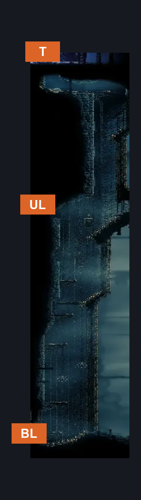
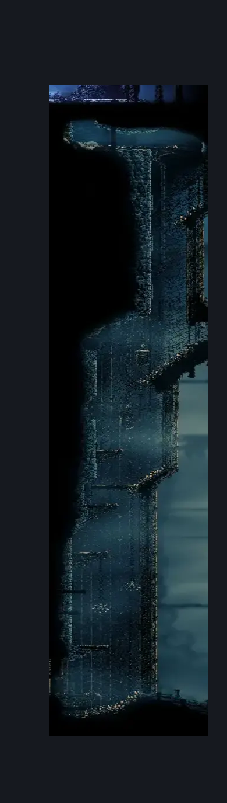

# Slab Shaft (Slab_21)

**Game ID:** Slab_21

## Subrooms

| No. | Subroom | Annotated |
| --- | --- | --- |
| S1 | Top |  |
| S2 | Mid |  |
| S3 | Bottom |  |

## Room Transitions

| Alias | Name | From subroom | Destination | Destination alias | Requirements | TODO | Verification | Annotated | Notes |
| --- | --- | --- | --- | --- | --- | --- | --- | --- | --- |
| BL | left3 | Bottom | [Slab Cavern Exit (Slab_23)](slab-cavern-exit.md) | R | none |  |  | ✓ | Naked. Logic accounting for not being able to do more. |
| T | top1 | Top | [Slab Chilly Top (Slab_22)](slab-chilly-top.md) | BR | cling grip OR silk soar |  |  | ✓ | Naked. Logic accounting for not being able to do more. |
| UL | left1 | Mid | [Slab Secret Side Room (Slab_18)](slab-secret-side-room.md) | R | none |  |  | ✓ | Naked. Logic accounting for not being able to do more. |

## Subroom Connections

| Alias | Name | Source | Destination | Requirements | TODO | Verification | Annotated | Notes |
| --- | --- | --- | --- | --- | --- | --- | --- | --- |
| V1 | Vertical 1 | Bottom | Mid | cling grip AND dash |  |  |  | Naked |
| V1 | Vertical 1 | Mid | Bottom | none |  |  |  | falling |
| V2 | Vertical 2 | Mid | Top | cling grip |  |  |  | Naked |
| V2 | Vertical 2 | Top | Mid | none |  |  |  | falling |

## Check Locations

No check locations defined.

## Room Images

### Connections

### Checks

### Scene

