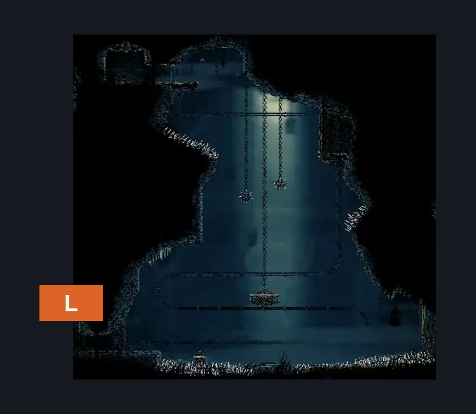
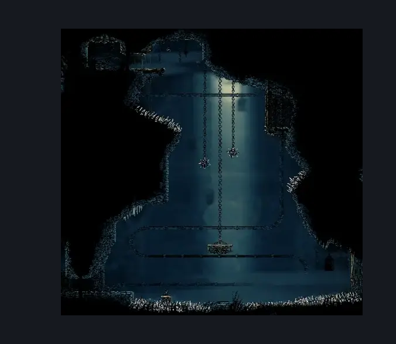

# Slab Why Room (Slab_17)

**Game ID:** Slab_17

## Subrooms

No subrooms defined.

## Room Transitions

| Alias | Name | From subroom | Destination | Destination alias | Requirements | TODO | Verification | Annotated | Notes |
| --- | --- | --- | --- | --- | --- | --- | --- | --- | --- |
| L | left1 |  | [Slab Cell (Slab_03)](slab-cell.md) | L0R | have Key of Apostate |  |  | ✓ |  |

## Subroom Connections

No subroom connections defined.

## Check Locations

| No. | Check | Subroom | Requirements | TODO | Verification | Location Type | Annotated | Notes |
| --- | --- | --- | --- | --- | --- | --- | --- | --- |
| 1 | The Slab (Key of Apostate) - Mask Shard |  | cling grip AND dash AND faydown AND clawline AND spike pogo AND drifter's cloak | TODO |  | collectible |  | Not actually tested, placeholded everything |

## Room Images

### Connections

### Checks

### Scene

