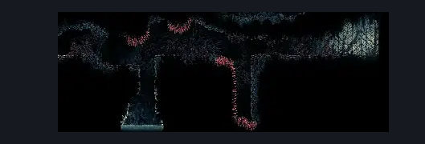
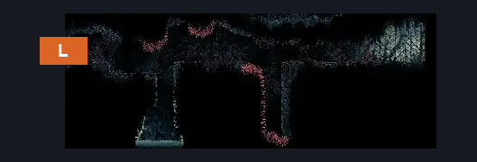

# Slab Window (Slab_12)

**Game ID:** Slab_12

## Subrooms

No subrooms defined.

## Room Transitions

| Alias | Name | From subroom | Destination | Destination alias | Requirements | TODO | Verification | Annotated | Notes |
| --- | --- | --- | --- | --- | --- | --- | --- | --- | --- |
| L | left1 |  | [Slab Cell (Slab_03)](slab-cell.md) | L8R | break wall left | TODO |  | ✓ | There's a breakable wall on the other side and it hasn't been tested on this side |

## Subroom Connections

No subroom connections defined.

## Check Locations

| No. | Check | Subroom | Requirements | TODO | Verification | Location Type | Annotated | Notes |
| --- | --- | --- | --- | --- | --- | --- | --- | --- |
| 1 | The Slab - Shell Shard Cache #4 |  | swim |  |  | collectible |  |  |
| 2 | The Slab - Shell Shard Cache #5 |  | swim |  |  | collectible |  |  |
| 3 | Relic: Weaver Effigy (Atla, The Slab) |  | cling grip AND (dash OR clawline OR faydown cloak) |  |  | collectible |  |  |

## Room Images

### Scene

### Connections

### Checks

