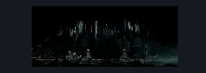
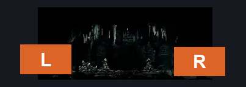
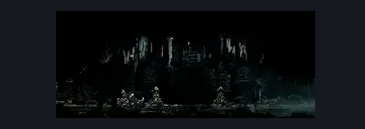

# Broken Elevator (Under_01b)

**Game ID:** Under_01b

**Contributors:** samupo

## Subrooms

No subrooms defined.

## Room Transitions

| Alias | Name | From subroom | Destination | Destination alias | Requirements | TODO | Verification | Annotated | Notes |
| --- | --- | --- | --- | --- | --- | --- | --- | --- | --- |
| L | left1 |  | [Grand Elevator (Under_01)](../grand-gate/grand-elevator.md) | R | none |  | Verified | ✓ |  |
| R | right1 |  | [Underworks Shaft (Under_02)](underworks-shaft.md) | L1 | Activate Locked Door |  | Verified | ✓ | one way, opens from this side |

## Subroom Connections

No subroom connections defined.

## Check Locations

| No. | Check | Subroom | Requirements | TODO | Verification | Location Type | Annotated | Notes |
| --- | --- | --- | --- | --- | --- | --- | --- | --- |
| 1 | Locked Door |  | Break Wall Right | TODO | Needs verification | blockade |  | verify ingame |

## Room Images

### Scene

### Connections

### Checks

