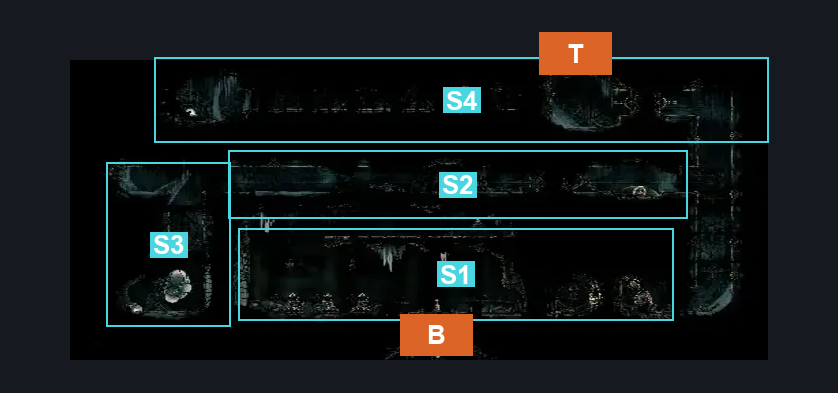
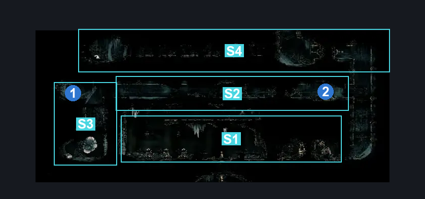
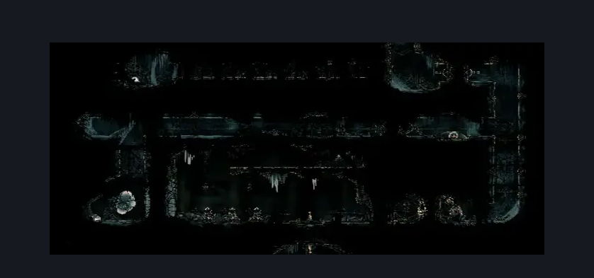

# Confession Toll (Under_08)

**Game ID:** Under_08

**Contributors:** samupo

## Subrooms

| No. | Subroom | Annotated |
| --- | --- | --- |
| S1 | Base | ✓ |
| S2 | Top | ✓ |
| S3 | Memory | ✓ |
| S4 | Secret | ✓ |

- **Secret:** Whiteward entrance?

## Room Transitions

| Alias | Name | From subroom | Destination | Destination alias | Requirements | TODO | Verification | Annotated | Notes |
| --- | --- | --- | --- | --- | --- | --- | --- | --- | --- |
| T | top1 | Secret | [Whiteward Unravelled Arena Room (Ward_02)](../whiteward/whiteward-unravelled-arena-room.md) | B | none | TODO | Needs verification | ✓ | has to be checked from white ward -verify ingame. |
| B | bot1 | Base | [Underworks Below Confession (Under_06)](underworks-below-confession.md) | T | none |  | Verified | ✓ |  |

## Subroom Connections

| Alias | Name | Source | Destination | Requirements | TODO | Verification | Annotated | Notes |
| --- | --- | --- | --- | --- | --- | --- | --- | --- |
| V | Base to Top | Base | Top | (Cling Grip AND (Faydown Cloak OR Dash OR Sharpdart OR Drifter's Cloak OR Ledge Grab)) OR Silk Soar |  | Verified |  |  |
| V2 | Top To Memory | Top | Memory | Faydown Cloak OR Ledge Grab OR Silk Soar | TODO | Needs verification |  | check cling grip as well when there's no ledge grab -verify ingame. |
| F | Top to Base | Top | Base | none |  |  |  | falling |
| S | Secret to Top | Secret | Top | none | TODO |  |  | falling |
| S2 | Secret to Memory | Secret | Memory | none | TODO |  |  | falling |

## Check Locations

| No. | Check | Subroom | Requirements | TODO | Verification | Location Type | Annotated | Notes |
| --- | --- | --- | --- | --- | --- | --- | --- | --- |
| 1 | Memory Locket: Underworks | Memory | none |  | Verified | collectible | ✓ |  |
| 2 | Shell Shard Cache: Underworks #15 | Top | none |  | Verified | resource | ✓ |  |
| 3 | Relic: Psalm Cylinder (Underworks) | Secret | TBD | TODO | Needs verification | collectible |  | verify ingame. |

## Room Images

### Connections

### Checks

### Scene

