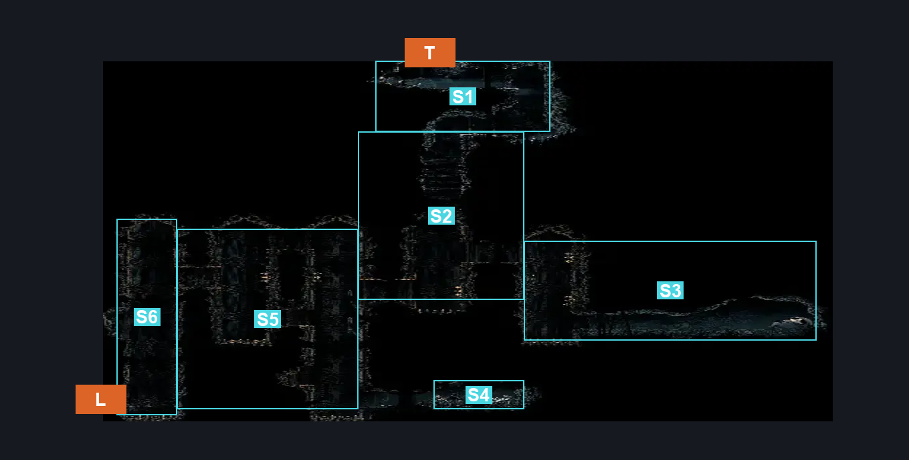
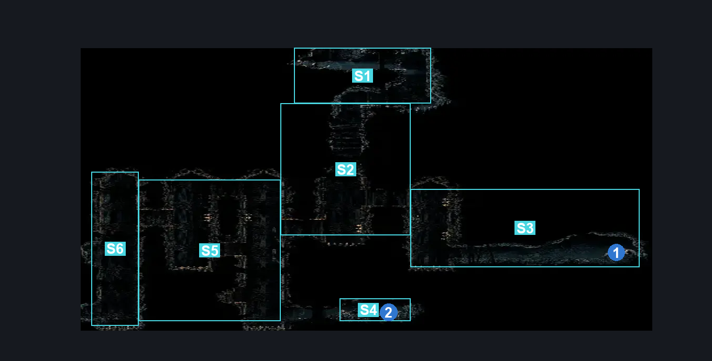
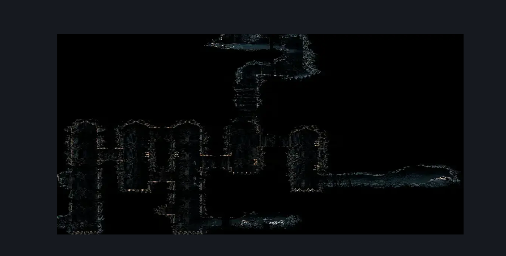

# Underworks Below Vaultkeeper (Library_12b)

**Game ID:** Library_12b

**Contributors:** Rebel

## Subrooms

| No. | Subroom | Annotated |
| --- | --- | --- |
| S1 | Top Exit Corner | ✓ |
| S2 | Top Exit Shaft | ✓ |
| S3 | Needolin Check | ✓ |
| S4 | Shell Shard Check | ✓ |
| S5 | Left Side Shafts | ✓ |
| S6 | Left Side Shaft Exit | ✓ |

## Room Transitions

| Alias | Name | From subroom | Destination | Destination alias | Requirements | TODO | Verification | Annotated | Notes |
| --- | --- | --- | --- | --- | --- | --- | --- | --- | --- |
| L | Left | Left Side Shaft Exit | [Underworks Exhaust Organ Transit (Library_12)](underworks-exhaust-organ-transit.md) | R | Nothing. |  | Verified | ✓ |  |
| T | Top | Top Exit Corner | [Vaultkeeper Cauldron Entrance (Library_10)](../whispering-vaults/vaultkeeper-cauldron-entrance.md) | B | Silk Soar OR Faydown Cloak OR Cling Grip OR Scuttlebrace |  | Verified | ✓ |  |

## Subroom Connections

| Alias | Name | Source | Destination | Requirements | TODO | Verification | Annotated | Notes |
| --- | --- | --- | --- | --- | --- | --- | --- | --- |
| TP | Top Path | Top Exit Corner | Top Exit Shaft | Nothing. (Fall) |  | Verified |  |  |
| TP | Top Path | Top Exit Shaft | Top Exit Corner | Cling Grip OR Scuttlebrace |  | Verified |  |  |
| NP | Needolin Path | Top Exit Shaft | Needolin Check | Nothing. (Fall) |  | Verified |  | pretty precise fall |
| NP | Needolin Path | Needolin Check | Top Exit Shaft | Cling Grip OR Spike Pogo |  | Verified |  |  |
| LP | Left Path | Top Exit Shaft | Left Side Shafts | Nothing. (Fall) |  | Verified |  |  |
| LP | Left Path | Left Side Shafts | Top Exit Shaft | Ledge Grab OR Clawline OR Scuttlebrace OR Faydown Cloak OR Easy Shaman Crest Pogo OR Easy Needle Strike Stall (Beast) |  | Verified |  |  |
| SP | Shell Path | Left Side Shafts | Shell Shard Check | Nothing. (fall) |  | Verified |  |  |
| SP | Shell Path | Shell Shard Check | Left Side Shafts | Cling Grip OR Scuttlebrace |  | Verified |  |  |
| LPC | Left Path, Continued | Left Side Shafts | Left Side Shaft Exit | Nothing. (Fall) |  | Verified |  |  |
| LPC | Left Path, Continued | Left Side Shaft Exit | Left Side Shafts | Cling Grip OR Scuttlebrace |  | Verified |  |  |

## Check Locations

| No. | Check | Subroom | Requirements | TODO | Verification | Location Type | Annotated | Notes |
| --- | --- | --- | --- | --- | --- | --- | --- | --- |
| 1 | Underworks: Needolin Lore #1 | Needolin Check | Needolin |  | Verified | lore | ✓ |  |
| 2 | Underworks: Shell Shard Cache #1 | Shell Shard Check | Nothing. |  | Verified | resource | ✓ |  |

## Room Images

### Connections

### Checks

### Scene

