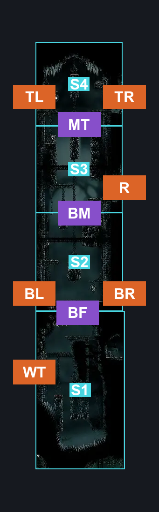
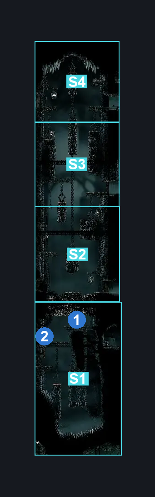
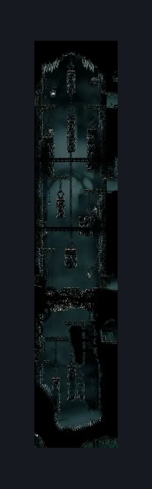

# Underworks Central Shaft (Under_05)

**Game ID:** Under_05

**Contributors:** samupo and Rebel

## Subrooms

| No. | Subroom | Annotated |
| --- | --- | --- |
| S1 | Wisp Thicket | ✓ |
| S2 | Bottom | ✓ |
| S3 | Mid | ✓ |
| S4 | Top | ✓ |

## Room Transitions

| Alias | Name | From subroom | Destination | Destination alias | Requirements | TODO | Verification | Annotated | Notes |
| --- | --- | --- | --- | --- | --- | --- | --- | --- | --- |
| TL | left1 | Top | [Underworks Below Confession (Under_06)](underworks-below-confession.md) | R | none |  | Verified | ✓ |  |
| R | right2 | Mid | [Underworks Rosary Room (Under_12)](underworks-rosary-room.md) | L | none |  | Verified | ✓ |  |
| BL | left2 | Bottom | [Underworks Crushing Path (Under_04)](underworks-crushing-path.md) | R | Activate Central Shaft Lever IN Underworks Crushing Path |  | Verified | ✓ |  |
| BR | right3 | Bottom | [Underworks Eastern Gauntlet (Under_10)](underworks-eastern-gauntlet.md) | L | none |  | Verified | ✓ |  |
| WT | left3 | Wisp Thicket | [Underworks Wisp Thicket Passage (Under_23)](underworks-wisp-thicket-passage.md) | R | none |  | Verified | ✓ |  |
| TR | right1 | Top | [Underworks Lever Spike Corridor (Under_11)](underworks-lever-spike-corridor.md) | L | none |  | Verified | ✓ |  |

## Subroom Connections

| Alias | Name | Source | Destination | Requirements | TODO | Verification | Annotated | Notes |
| --- | --- | --- | --- | --- | --- | --- | --- | --- |
| BF | Break Floor | Wisp Thicket | Bottom | (Activate Breakable Saw Floor AND cling grip AND (spike pogo OR clawline OR Sharpdart OR faydown cloak)) OR ( Activate Breakable Saw Floor AND Scuttlebrace AND Faydown Cloak AND (Clawline OR Sharpdart)) OR (Activate Wisp Thicket Connection Lever AND Activate Breakable Saw Floor AND (Cling Grip OR Silk Soar OR (Scuttlebrace AND Faydown Cloak))) |  | Verified | ✓ |  |
| BM | Bototm to Mid | Bottom | Mid | silk soar OR (cling grip AND (dash OR ledge grab OR faydown cloak OR sharpdart OR clawline OR drifter's cloak)) OR (Scuttlebrace AND (Faydown Cloak OR Sharpdart OR Clawline)) |  | Verified | ✓ |  |
| MT | Mid to Top | Mid | Top | silk soar OR cling grip OR (Scuttlebrace AND Proficient Movement) |  | Verified | ✓ |  |
| MT | Mid to Top | Top | Mid | Nothing. (Fall) |  | Verified | ✓ |  |
| BM | Bototm to Mid | Mid | Bottom | Nothing. (Fall) |  | Verified | ✓ |  |
| BF | Break Floor | Bottom | Wisp Thicket | (Activate Breakable Saw Floor AND ((Cling Grip OR Scuttlebrace) AND (Sharpdart OR Clawline OR (Faydown Cloak AND Dash)))) |  | Verified | ✓ |  |

## Check Locations

| No. | Check | Subroom | Requirements | TODO | Verification | Location Type | Annotated | Notes |
| --- | --- | --- | --- | --- | --- | --- | --- | --- |
| 1 | Breakable Saw Floor | Wisp Thicket | Break Wall Left OR Break Wall Right |  | Verified | blockade | ✓ |  |
| 2 | Wisp Thicket Connection Lever | Wisp Thicket | Flip Switch Left |  | Verified | switch | ✓ |  |

## Room Images

### Connections

### Checks

### Scene

