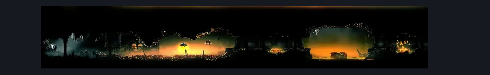

# Underworks Craftmetal Corridor (Under_19b)

**Game ID:** Under_19b

**Contributors:** Rebel

## Subrooms

| No. | Subroom | Annotated |
| --- | --- | --- |
| S1 | Fuckass Jump Left | ✓ |
| S2 | Fuckass Jump Right | ✓ |

## Room Transitions

| Alias | Name | From subroom | Destination | Destination alias | Requirements | TODO | Verification | Annotated | Notes |
| --- | --- | --- | --- | --- | --- | --- | --- | --- | --- |
| R | right1 | Fuckass Jump Right | [Underworks Clawline Entrance (Under_19c)](underworks-clawline-entrance.md) | BL | Nothing. |  | Verified | ✓ |  |

## Subroom Connections

| Alias | Name | Source | Destination | Requirements | TODO | Verification | Annotated | Notes |
| --- | --- | --- | --- | --- | --- | --- | --- | --- |
| J | Jump | Fuckass Jump Left | Fuckass Jump Right | Ledge Grab OR Clawline OR Sharpdart OR Cling Grip OR Scuttlebrace OR Sprint OR Dash OR Faydown Cloak OR Drifter's Cloak OR Easy Shaman Crest Pogo OR Easy Beast Crest Pogo OR Easy Architect Crest Pogo OR Easy Hunter Crest Pogo OR Easy Reaper Crest Pogo OR Easy Needle Strike Stall (Witch OR Wanderer) | TODO | Verified |  | why couldnt you have been TWO pixels shorter? -need hunter and reaper crest pogos |
| J | Jump | Fuckass Jump Right | Fuckass Jump Left | Nothing. |  | Verified |  |  |

## Check Locations

| No. | Check | Subroom | Requirements | TODO | Verification | Location Type | Annotated | Notes |
| --- | --- | --- | --- | --- | --- | --- | --- | --- |
| 1 | Underworks: Craftmetal #1 | Fuckass Jump Left | Nothing. |  | Verified | collectible | ✓ |  |

## Room Images

### Connections

### Checks

### Scene

