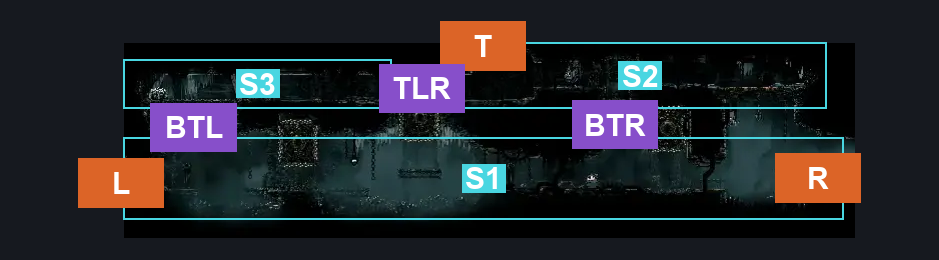
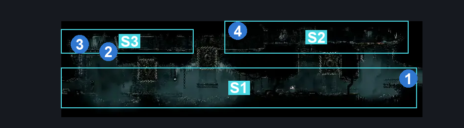

# Underworks Crushing Path (Under_04)

**Game ID:** Under_04

**Contributors:** samupo and Rebel

## Subrooms

| No. | Subroom | Annotated |
| --- | --- | --- |
| S1 | Bottom | ✓ |
| S2 | Top Right | ✓ |
| S3 | Top Left | ✓ |

- **Bottom:** suprisingly it can be routed itemless.

## Room Transitions

| Alias | Name | From subroom | Destination | Destination alias | Requirements | TODO | Verification | Annotated | Notes |
| --- | --- | --- | --- | --- | --- | --- | --- | --- | --- |
| L | left1 | Bottom | [Underworks Saw Shaft (Under_03c)](underworks-saw-shaft.md) | R | nada |  | Verified | ✓ | may be other options |
| T | top1 | Top Right | [Underworks Gym (Under_03d)](underworks-gym.md) | B | Cling Grip OR Scuttlebrace OR Silk Soar OR Faydown Cloak |  | Verified | ✓ |  |
| R | right1 | Bottom | [Underworks Central Shaft (Under_05)](underworks-central-shaft.md) | BL | Activate Central Shaft Lever |  | Verified | ✓ | may be other options |

## Subroom Connections

| Alias | Name | Source | Destination | Requirements | TODO | Verification | Annotated | Notes |
| --- | --- | --- | --- | --- | --- | --- | --- | --- |
| BTR | Bottom <> Top Right | Bottom | Top Right | Cling Grip OR Silk Soar OR ((Proficient Movement (Crush Block Pogo) OR Faydown Cloak) AND Scuttlebrace) |  | Verified | ✓ |  |
| BTR | Bottom <> Top Right | Top Right | Bottom | Nothing. (Fall) |  | Verified | ✓ |  |
| BTL | Bottom <> Top Left | Bottom | Top Left | (Activate Breakable Ceiling AND ((Scuttlebrace AND (Clawline OR Sharpdart)) OR (Cling Grip AND (Dash OR Faydown Cloak OR Clawline OR Sharpdart OR Easy Flea Brew Stall OR Medium Voltvessels Stall OR Medium Plasmium Stall OR Easy Architect Charge OR Easy Beast Charge OR Easy Shaman Pogo)))) |  | Verified | ✓ |  |
| BTL | Bottom <> Top Left | Top Left | Bottom | Activate Breakable Ceiling |  | Verified | ✓ |  |
| TLR | Top Left <> Top Right | Top Right | Top Left | Sprint OR Dash OR Faydown Cloak OR Drifter's Cloak OR Clawline OR Sharpdart OR Scuttlebrace |  | Verified | ✓ |  |
| TLR | Top Left <> Top Right | Top Left | Top Right | Sprint OR Dash OR Faydown Cloak OR Drifter's Cloak OR Clawline OR Sharpdart OR Scuttlebrace |  | Verified | ✓ |  |

## Check Locations

| No. | Check | Subroom | Requirements | TODO | Verification | Location Type | Annotated | Notes |
| --- | --- | --- | --- | --- | --- | --- | --- | --- |
| 1 | Central Shaft Lever | Bottom | Flip Switch Right |  | Verified | switch | ✓ |  |
| 2 | Snapping Floor | Top Left | Break Wall Down |  | Verified | blockade | ✓ |  |
| 3 | Underworks: Shell Shard Cache #14 | Top Left | Ledge Grab OR Sprint OR Dash OR Faydown Cloak OR Drifter's Cloak OR Clawline OR Sharpdart OR Scuttlebrace |  | Verified | collectible | ✓ | is it 14? -platform falling makes it unobtainable itemless, this is fine since the only way to make the platform fall is to get to it. just marking for posterity |
| 4 | Breakable Ceiling | Top Right | Break Wall Up |  | Verified | blockade | ✓ |  |

## Room Images

### Connections

### Checks

### Scene

