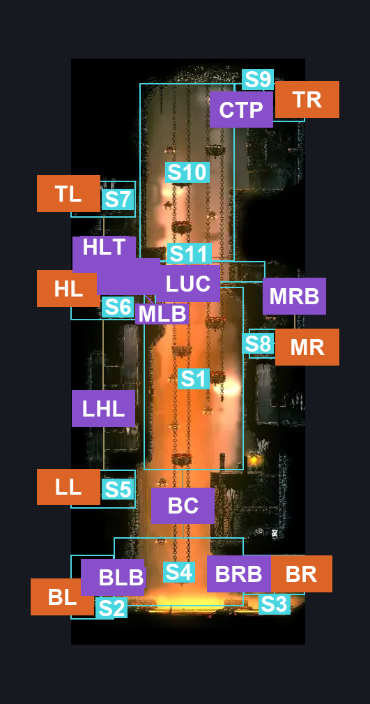
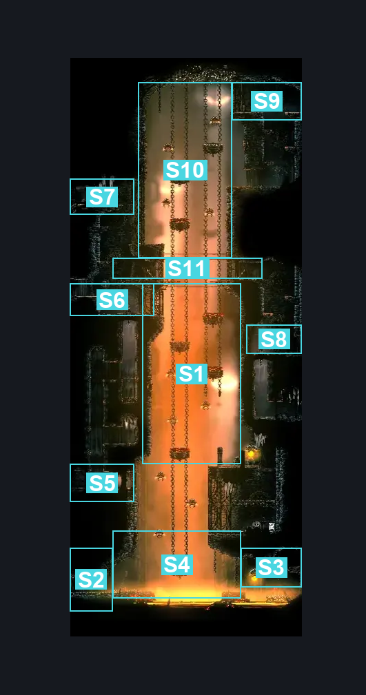
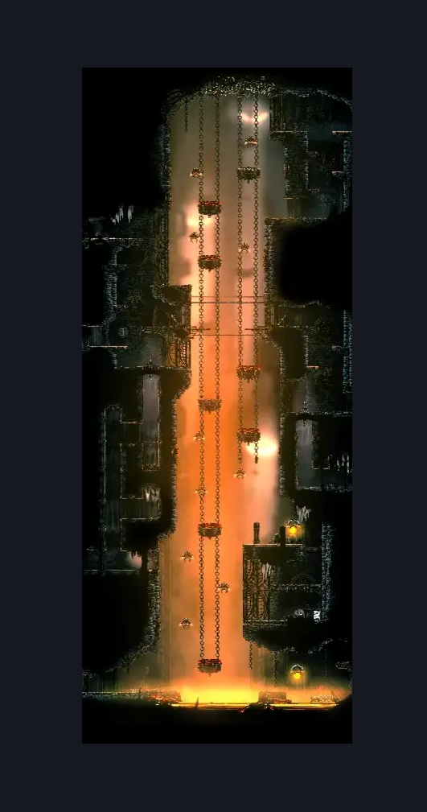

# Underworks East Shaft (Under_13)

**Game ID:** Under_13

**Contributors:** Rebel

## Subrooms

| No. | Subroom | Annotated |
| --- | --- | --- |
| S1 | Lower Central Shaft | ✓ |
| S2 | Bottom Left Entrance | ✓ |
| S3 | Bottom Right Entrance | ✓ |
| S4 | Bottom | ✓ |
| S5 | Lower Left Entrance | ✓ |
| S6 | High Left Entrance | ✓ |
| S7 | Top Left Entrance | ✓ |
| S8 | Mid Right Entrance | ✓ |
| S9 | Top Right Entrance | ✓ |
| S10 | Upper Central Shaft | ✓ |
| S11 | Bridge | ✓ |

## Room Transitions

| Alias | Name | From subroom | Destination | Destination alias | Requirements | TODO | Verification | Annotated | Notes |
| --- | --- | --- | --- | --- | --- | --- | --- | --- | --- |
| BL | Bottom Left | Bottom Left Entrance | [Underworks Flea Room (Under_21)](underworks-flea-room.md) | R | Nothing. |  | Verified | ✓ |  |
| BR | Bottom Right | Bottom Right Entrance | [Underworks Lava Flow Corridor (Under_19)](underworks-lava-flow-corridor.md) | L | Nothing. |  | Verified | ✓ |  |
| TL | Top Left | Top Left Entrance | [Underworks Lever Spike Corridor (Under_11)](underworks-lever-spike-corridor.md) | R | Nothing. |  | Verified | ✓ |  |
| TR | Top Right | Top Right Entrance | [Underworks Twelfth Architect (Under_17)](underworks-twelfth-architect.md) | FL | Nothing. |  | Verified | ✓ |  |
| HL | High Left | High Left Entrance | [Underworks Ventrica (Under_22)](underworks-ventrica.md) | R | Nothing. |  | Verified | ✓ |  |
| MR | Mid Right | Mid Right Entrance | [Underworks Clawline Room (Under_18)](underworks-clawline-room.md) | L | Nothing. |  | Verified | ✓ |  |
| LL | Low Left | Lower Left Entrance | [Underworks Eastern Gauntlet (Under_10)](underworks-eastern-gauntlet.md) | R | Nothing. |  | Verified | ✓ |  |

## Subroom Connections

| Alias | Name | Source | Destination | Requirements | TODO | Verification | Annotated | Notes |
| --- | --- | --- | --- | --- | --- | --- | --- | --- |
| BC | Bottom-Lower Central | Bottom | Lower Central Shaft | Silk Soar OR ((Faydown Cloak OR Clawline) AND (Enemy Pogo OR Cling Grip OR Scuttlebrace)) |  | Verified | ✓ |  |
| LHL | Lower Left-High Left | Lower Left Entrance | High Left Entrance | Open Airlock Up AND (Cling Grip OR Scuttlebrace) |  | Verified | ✓ |  |
| LHL | Lower Left-High Left | High Left Entrance | Lower Left Entrance | Open Airlock Down |  | Verified | ✓ |  |
| HLT | High Left-Top Left | High Left Entrance | Top Left Entrance | Silk Soar OR Faydown Cloak OR Cling Grip OR Scuttlebrace |  | Verified | ✓ |  |
| HLT | High Left-Top Left | Top Left Entrance | High Left Entrance | Nothing. (Fall) |  | Verified | ✓ |  |
| LUC | Lower Central-Upper Central | Lower Central Shaft | Upper Central Shaft | Silk Soar OR Cling Grip OR Scuttlebrace |  | Verified | ✓ |  |
| LUC | Lower Central-Upper Central | Upper Central Shaft | Lower Central Shaft | Nothing. (Fall) |  | Verified | ✓ |  |
| BC | Bottom-Lower Central | Lower Central Shaft | Bottom | Nothing. (Fall) |  | Verified | ✓ |  |
| CTP | Upper Central-Top Left | Upper Central Shaft | Top Right Entrance | Clawline OR Ledge Grab OR Scuttlebrace OR Faydown Cloak OR Cling Grip OR Silk Soar |  | Verified | ✓ |  |
| CTP | Upper Central-Top Left | Top Right Entrance | Upper Central Shaft | Nothing. (Fall) |  | Verified | ✓ |  |
| BLB | Bottom Left <> Bottom | Bottom Left Entrance | Bottom | Ledge Grab OR Faydown Cloak OR Cling Grip |  | Verified | ✓ |  |
| BRB | Bottom Right <> Bottom | Bottom Right Entrance | Bottom | ((Ledge Grab OR Cling Grip OR Scuttlebrace) AND (Dash OR Sprint OR Clawline OR Sharpdart OR Easy Shaman Pogo OR Easy Architect Charge OR Easy Beast Charge OR Faydown Cloak)) |  | Verified | ✓ |  |
| BLB | Bottom Left <> Bottom | Bottom | Bottom Left Entrance | Nothing. (Fall) |  | Verified | ✓ |  |
| BRB | Bottom Right <> Bottom | Bottom | Bottom Right Entrance | Ledge Grab OR Cling Grip OR Faydown Cloak |  | Verified | ✓ |  |
| MLB | Mid Left <> Bridge | High Left Entrance | Bridge | Activate Underworks East Bridge Switch |  | Verified | ✓ |  |
| MRB | Mid Right <> Bridge | Mid Right Entrance | Bridge | (Activate Underworks East Bridge Switch AND (Cling Grip OR Faydown Cloak OR (Medium Scuttlebrace AND (Clawline OR Sharpdart x 2)))) |  | Verified | ✓ |  |
| MRB | Mid Right <> Bridge | Bridge | Mid Right Entrance | Activate Underworks East Bridge Switch |  | Verified | ✓ |  |
| MLB | Mid Left <> Bridge | Bridge | High Left Entrance | Activate Underworks East Bridge Switch |  | Verified | ✓ |  |

## Check Locations

| No. | Check | Subroom | Requirements | TODO | Verification | Location Type | Annotated | Notes |
| --- | --- | --- | --- | --- | --- | --- | --- | --- |
| 1 | Underworks East Bridge Switch | Mid Right Entrance | Flip Switch Left |  | Verified | switch |  |  |

## Room Images

### Connections

### Checks

### Scene

