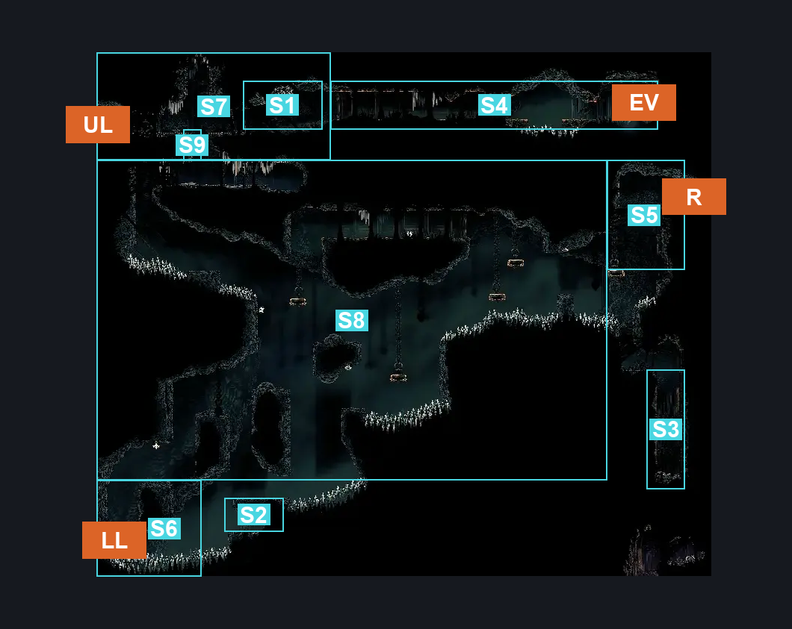
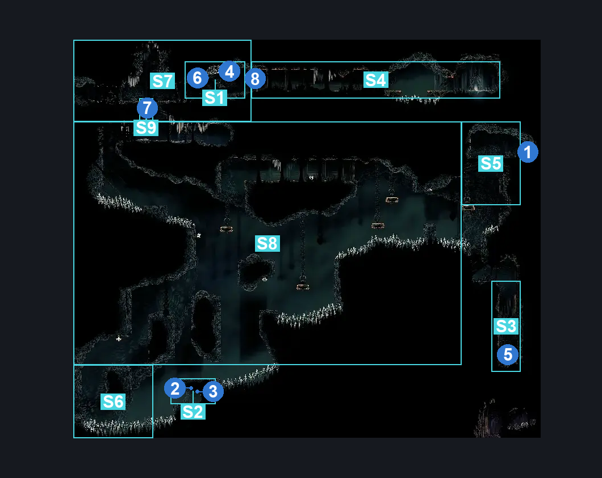
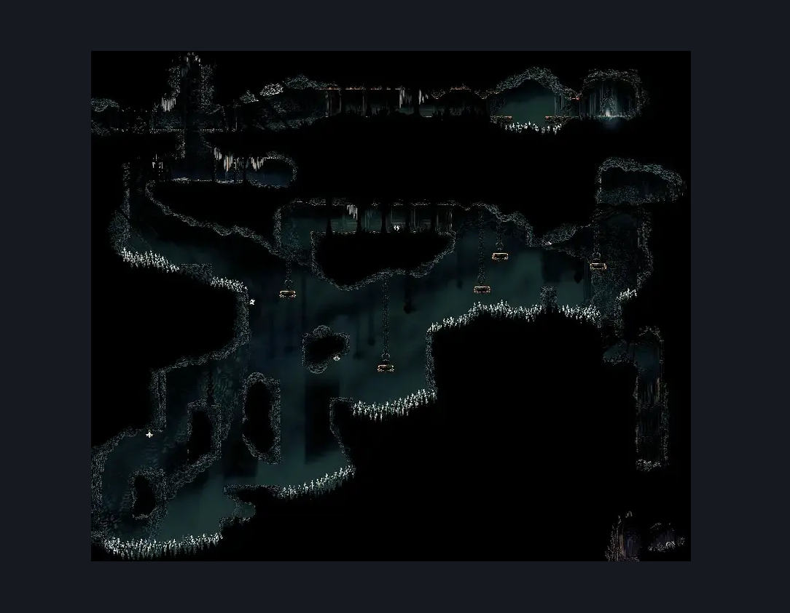

# Underworks Exhaust Organ Transit (Library_12)

**Game ID:** Library_12

**Contributors:** Rebel

## Subrooms

| No. | Subroom | Annotated |
| --- | --- | --- |
| S1 | Shell Shard Cache #1 | ✓ |
| S2 | Shell Shard Cache #2 | ✓ |
| S3 | Shell Bundle Pickup | ✓ |
| S4 | Exhaust Organ Elevator | ✓ |
| S5 | Far Right | ✓ |
| S6 | Lower Left | ✓ |
| S7 | Upper Left | ✓ |
| S8 | Center | ✓ |

## Room Transitions

| Alias | Name | From subroom | Destination | Destination alias | Requirements | TODO | Verification | Annotated | Notes |
| --- | --- | --- | --- | --- | --- | --- | --- | --- | --- |
| UL | Upper Left | Upper Left | [Vaults & Bellway Cauldron Entrance (Library_11)](vaults-bellway-cauldron-entrance.md) | UR | Nothing. |  | Verified | ✓ |  |
| LL | Lower Left | Lower Left | [Vaults & Bellway Cauldron Entrance (Library_11)](vaults-bellway-cauldron-entrance.md) | LR | Nothing. |  | Verified | ✓ |  |
| EV | Elevator | Exhaust Organ Elevator | [Exhaust Organ Interior (Organ_01)](../bilewater/exhaust-organ-interior.md) | UE | Nothing. |  | Verified | ✓ |  |
| R | Right | Far Right | [Underworks Below Vaultkeeper (Library_12b)](underworks-below-vaultkeeper.md) | L | Nothing. |  | Verified | ✓ |  |

## Subroom Connections

| Alias | Name | Source | Destination | Requirements | TODO | Verification | Annotated | Notes |
| --- | --- | --- | --- | --- | --- | --- | --- | --- |
| SB | Collect Shell Bundle | Far Right | Shell Bundle Pickup | Nothing. (Fall) |  | Verified | ✓ |  |
| SB | Collect Shell Bundle | Shell Bundle Pickup | Far Right | Silk Soar OR (Scuttlebrace AND Spike Pogo) OR (Cling Grip AND (Spike Pogo OR Faydown Cloak OR Drifter's Cloak OR Clawline OR Sharp Dart)) |  | Verified | ✓ |  |
| CFR | Center-Far Right | Far Right | Center | Spike Pogo OR Sprint OR Dash OR Faydown Cloak OR Drifter's Cloak OR Clawline OR Sharp Dart OR Scuttlebrace |  | Verified | ✓ |  |
| CT | Center-Top | Center | Upper Left | Activate Underworks Spool Room Upper Floor AND ((Scuttlebrace AND (Faydown Cloak OR Clawline OR Sharp Dart)) OR ((Sprint OR Spike Pogo) AND (Ledge Grab OR Dash OR Drifter's Cloak)) OR ((Cling Grip AND (Spike Pogo OR Drifter's Cloak OR Faydown Cloak OR Clawline OR Sharp Dart OR Dash OR Easy Beast Pogo OR Easy Beast Charge OR Easy Architect Charge)))) |  | Verified | ✓ |  |
| CL | Center-Low | Lower Left | Center | (Silk Soar AND (Clawline OR Sharp Dart OR Dash OR Faydown Cloak OR Drifter's Cloak OR Easy Beast Pogo)) OR Cling Grip OR Scuttlebrace |  | Verified | ✓ |  |
| CFR | Center-Far Right | Center | Far Right | (Silk Soar AND (Clawline OR Dash OR Sharp Dart OR Drifter's Cloak OR Faydown Cloak)) OR Scuttlebrace OR Cling Grip |  | Verified | ✓ |  |
| CL | Center-Low | Center | Lower Left | Silk Soar OR Faydown Cloak OR Drifter's Cloak OR Dash OR Cling Grip OR Clawline OR Sharp Dart OR Scuttlebrace OR Spike Pogo |  | Verified | ✓ |  |
| CT | Center-Top | Upper Left | Center | Activate Underworks Spool Room Upper Floor |  | Verified | ✓ | IF floor is broken. |
| SP | Shard Pillars Center | Center | Shell Shard Cache #2 | Nothing. (Fall) |  | Verified | ✓ |  |
| SSR | Shell Shard Rocks | Upper Left | Shell Shard Cache #1 | Nothing. |  | Verified | ✓ |  |
| SPL | Shard Pillars Left | Lower Left | Shell Shard Cache #2 | Spike Pogo OR (Clawline AND Sharp Dart AND Ledge Grab) OR (Clawline AND (Faydown Cloak OR Drifter's Cloak)) |  | Verified | ✓ |  |
| ET | Elevator Transit | Upper Left | Exhaust Organ Elevator | Activate Underworks Exhaust Organ Lever |  | Verified |  |  |
| ET | Elevator Transit | Exhaust Organ Elevator | Upper Left | Nothing. |  | Verified |  |  |
| SSR | Shell Shard Rocks | Shell Shard Cache #1 | Upper Left | Nothing. |  | Verified | ✓ |  |
| SPL | Shard Pillars Left | Shell Shard Cache #2 | Lower Left | Spike Pogo OR (Clawline AND Sharp Dart AND Ledge Grab) OR (Clawline AND (Faydown Cloak OR Drifter's Cloak)) |  | Verified | ✓ |  |
| SP | Shard Pillars Center | Shell Shard Cache #2 | Center | Silk Soar OR (Faydown Cloak AND (Cling Grip OR Scuttlebrace)) |  | Verified | ✓ |  |

## Check Locations

| No. | Check | Subroom | Requirements | TODO | Verification | Location Type | Annotated | Notes |
| --- | --- | --- | --- | --- | --- | --- | --- | --- |
| 1 | Underworks: Break Wall #1 (Left OR Right) | Far Right | Nothing. |  | Verified | switch | ✓ |  |
| 2 | Underworks: Shell Shard Pillar #1 | Shell Shard Cache #2 | Nothing. |  | Verified | collectible | ✓ |  |
| 3 | Underworks: Shell Shard Pillar #2 | Shell Shard Cache #2 | Nothing. |  | Verified | collectible | ✓ |  |
| 4 | Underworks: Shell Shard Rock #2 | Shell Shard Cache #1 | Nothing. |  | Verified | collectible | ✓ |  |
| 5 | Underworks: Shard Bundle #1 | Shell Bundle Pickup | Nothing. |  | Verified | collectible | ✓ |  |
| 6 | Underworks: Shell Shard Rock #1 | Shell Shard Cache #1 | Nothing. |  | Verified | collectible | ✓ |  |
| 7 | Underworks Spool Room Upper Floor | Center | Break Wall Up |  | Verified | blockade | ✓ |  |
| 8 | Underworks Exhaust Organ Lever | Exhaust Organ Elevator | Flip Switch Left |  | Verified | switch | ✓ |  |
| 9 | import enemies |  |  | TODO | Needs verification |  |  |  |

## Room Images

### Connections

### Checks

### Scene

