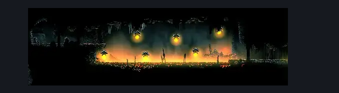
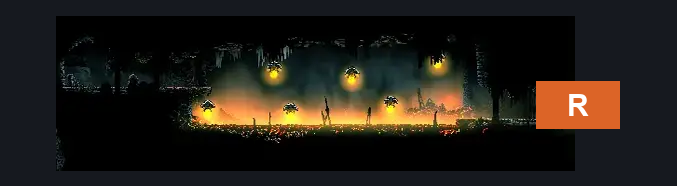
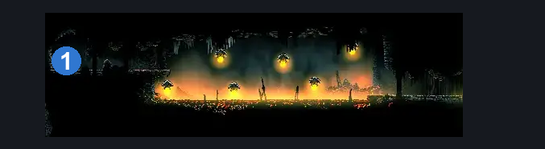

# Underworks Flea Room (Under_21)

**Game ID:** Under_21

**Contributors:** Rebel

## Subrooms

| No. | Subroom | Annotated |
| --- | --- | --- |
| S1 | Entrance |  |
| S2 | Flea |  |

## Room Transitions

| Alias | Name | From subroom | Destination | Destination alias | Requirements | TODO | Verification | Annotated | Notes |
| --- | --- | --- | --- | --- | --- | --- | --- | --- | --- |
| R | right1 | Entrance | [Underworks East Shaft (Under_13)](underworks-east-shaft.md) | BL | Nothing. |  | Verified | ✓ |  |

## Subroom Connections

| Alias | Name | Source | Destination | Requirements | TODO | Verification | Annotated | Notes |
| --- | --- | --- | --- | --- | --- | --- | --- | --- |
| FG | Flea Get | Entrance | Flea | Ledge Grab OR Clawline OR  Cling Grip OR Scuttlebrace OR Faydown Cloak OR Silk Soar |  | Verified |  |  |
| FG | Flea Get | Flea | Entrance | Nothing. (Fall) |  | Verified |  |  |

## Check Locations

| No. | Check | Subroom | Requirements | TODO | Verification | Location Type | Annotated | Notes |
| --- | --- | --- | --- | --- | --- | --- | --- | --- |
| 1 | Underworks: Flea #1 | Flea | Nothing. |  | Verified | collectible | ✓ |  |

## Room Images

### Scene

### Connections

### Checks

