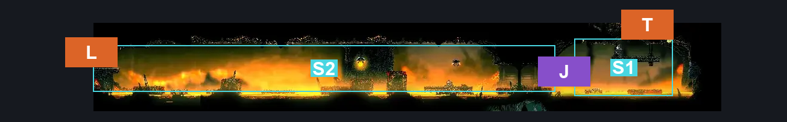
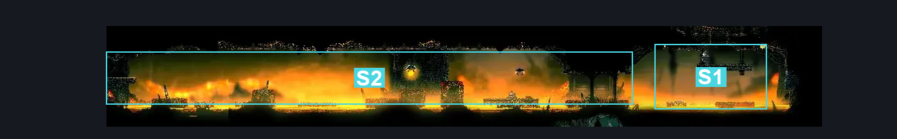
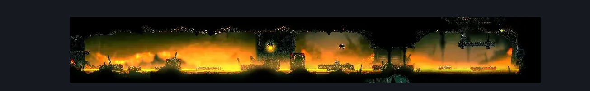

# Underworks Lava Flow Corridor (Under_19)

**Game ID:** Under_19

**Contributors:** Rebel

## Subrooms

| No. | Subroom | Annotated |
| --- | --- | --- |
| S1 | Right Exit | ✓ |
| S2 | Main | ✓ |

## Room Transitions

| Alias | Name | From subroom | Destination | Destination alias | Requirements | TODO | Verification | Annotated | Notes |
| --- | --- | --- | --- | --- | --- | --- | --- | --- | --- |
| T | top1 | Right Exit | [Underworks Clawline Entrance (Under_19c)](underworks-clawline-entrance.md) | B | Nothing. |  | Verified | ✓ |  |
| L | left1 | Main | [Underworks East Shaft (Under_13)](underworks-east-shaft.md) | BR | Nothing. |  | Verified | ✓ |  |

## Subroom Connections

| Alias | Name | Source | Destination | Requirements | TODO | Verification | Annotated | Notes |
| --- | --- | --- | --- | --- | --- | --- | --- | --- |
| J | Jump | Right Exit | Main | Clawline OR Sharp Dart OR Dash OR Faydown Cloak OR Drifter's Cloak OR Scuttlebrace |  | Verified | ✓ |  |
| J | Jump | Main | Right Exit | Scuttlebrace OR ((Clawline OR Sharp Dart OR Dash) AND (Faydown Cloak OR Cling Grip)) |  | Verified | ✓ |  |

## Check Locations

| No. | Check | Subroom | Requirements | TODO | Verification | Location Type | Annotated | Notes |
| --- | --- | --- | --- | --- | --- | --- | --- | --- |
| 1 | import enemies |  |  | TODO | Needs verification |  |  |  |

## Room Images

### Connections

### Checks

### Scene

