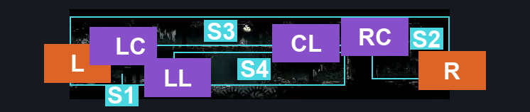
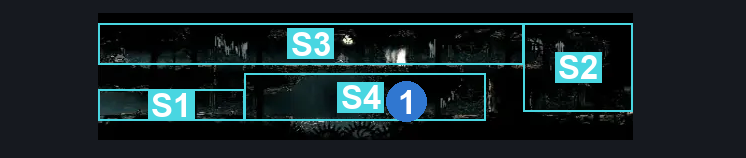
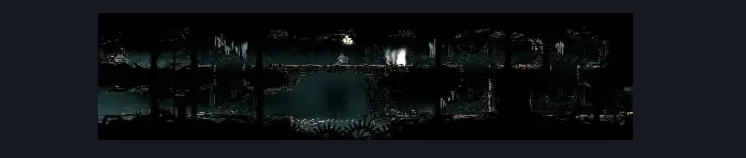

# Underworks Lever Spike Corridor (Under_11)

**Game ID:** Under_11

**Contributors:** Rebel

## Subrooms

| No. | Subroom | Annotated |
| --- | --- | --- |
| S1 | Left Side Entrance | ✓ |
| S2 | Right Side Entrance | ✓ |
| S3 | Central Top Shaft | ✓ |
| S4 | Lever Shaft | ✓ |

## Room Transitions

| Alias | Name | From subroom | Destination | Destination alias | Requirements | TODO | Verification | Annotated | Notes |
| --- | --- | --- | --- | --- | --- | --- | --- | --- | --- |
| L | left1 | Left Side Entrance | [Underworks Central Shaft (Under_05)](underworks-central-shaft.md) | TR | Nothing. |  | Verified | ✓ |  |
| R | right1 | Right Side Entrance | [Underworks East Shaft (Under_13)](underworks-east-shaft.md) | TL | Nothing. |  | Verified | ✓ |  |

## Subroom Connections

| Alias | Name | Source | Destination | Requirements | TODO | Verification | Annotated | Notes |
| --- | --- | --- | --- | --- | --- | --- | --- | --- |
| LC | Left-CentraL | Left Side Entrance | Central Top Shaft | Silk Soar OR Cling Grip OR Scuttlebrace OR Faydown Cloak |  | Verified | ✓ |  |
| LC | Left-CentraL | Central Top Shaft | Left Side Entrance | Nothing. (Fall) |  | Verified | ✓ |  |
| RC | Right-Central | Right Side Entrance | Central Top Shaft | Silk Soar OR Cling Grip OR Scuttlebrace OR Faydown Cloak |  | Verified | ✓ |  |
| RC | Right-Central | Central Top Shaft | Right Side Entrance | Nothing. (Fall) |  | Verified | ✓ |  |
| CL | Central-Lever | Central Top Shaft | Lever Shaft | Nothing. (fall) |  | Verified | ✓ |  |
| CL | Central-Lever | Lever Shaft | Central Top Shaft | Activate Shaft Shortcut Lever  AND (Silk Soar OR Cling Grip OR Scuttlebrace OR Faydown Cloak) |  | Verified | ✓ |  |
| LL | Left-Lever | Left Side Entrance | Lever Shaft | Activate Shaft Shortcut Lever  AND (Spike Pogo OR Dash OR Sprint OR Clawline OR Sharp Dart OR Faydown Cloak OR Drifter's Cloak OR Scuttlebrace) |  | Verified | ✓ |  |
| LL | Left-Lever | Lever Shaft | Left Side Entrance | Activate Shaft Shortcut Lever  AND (Spike Pogo OR Dash OR Sprint OR Clawline OR Sharp Dart OR Faydown Cloak OR Drifter's Cloak OR Scuttlebrace) |  | Verified | ✓ |  |

## Check Locations

| No. | Check | Subroom | Requirements | TODO | Verification | Location Type | Annotated | Notes |
| --- | --- | --- | --- | --- | --- | --- | --- | --- |
| 1 | Shaft Shortcut Lever | Lever Shaft | Nothing. |  | Verified | switch | ✓ |  |

## Room Images

### Connections

### Checks

### Scene

