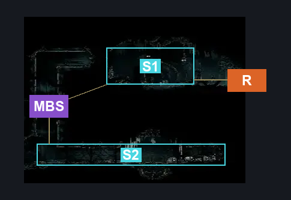
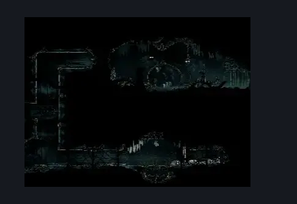

# Underworks Map Room (Under_16)

**Game ID:** Under_16

**Contributors:** samupo

## Subrooms

No subrooms defined.

## Room Transitions

| Alias | Name | From subroom | Destination | Destination alias | Requirements | TODO | Verification | Annotated | Notes |
| --- | --- | --- | --- | --- | --- | --- | --- | --- | --- |
| R | right1 |  | [Underworks Shaft (Under_02)](underworks-shaft.md) | L2 | none | TODO | Verified | ✓ |  |

## Subroom Connections

No subroom connections defined.

## Check Locations

| No. | Check | Subroom | Requirements | TODO | Verification | Location Type | Annotated | Notes |
| --- | --- | --- | --- | --- | --- | --- | --- | --- |
| 1 | Map Pickup: Underworks |  | none | TODO | Verified | collectible |  |  |
| 2 | Relic: Bone Scroll (Underworks) |  | none | TODO | Verified | collectible |  |  |
| 3 | Underworks: Break Wall #4 |  | Break Wall Left | TODO | Needs verification | blockade |  | Verify ingame. |

## Room Images

### Connections

### Checks

### Scene

