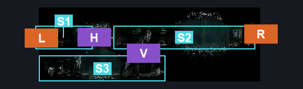
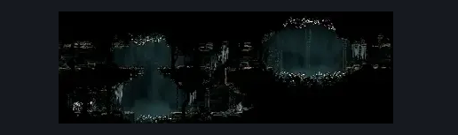

# Underworks Saw Intro (Under_03b)

**Game ID:** Under_03b

**Contributors:** samupo

## Subrooms

| No. | Subroom | Annotated |
| --- | --- | --- |
| S1 | Left |  |
| S2 | Right |  |

## Room Transitions

| Alias | Name | From subroom | Destination | Destination alias | Requirements | TODO | Verification | Annotated | Notes |
| --- | --- | --- | --- | --- | --- | --- | --- | --- | --- |
| L | left1 | Left | [Underworks Shaft (Under_02)](underworks-shaft.md) | R2 | none | TODO |  | ✓ |  |
| R | right1 | Right | [Underworks Saw Shaft (Under_03c)](underworks-saw-shaft.md) | L2 | none | TODO |  | ✓ |  |

## Subroom Connections

| Alias | Name | Source | Destination | Requirements | TODO | Verification | Annotated | Notes |
| --- | --- | --- | --- | --- | --- | --- | --- | --- |
| H | Horizontal | Left | Right | ledge grab OR dash OR clawline OR cling grip | TODO |  |  |  |
| H | Horizontal | Right | Left | ledge grab OR dash OR clawline | TODO |  |  |  |

## Check Locations

| No. | Check | Subroom | Requirements | TODO | Verification | Location Type | Annotated | Notes |
| --- | --- | --- | --- | --- | --- | --- | --- | --- |
| 1 | Shell Shard Cache: Underworks #12 | Left | none | TODO |  | collectible |  |  |

## Room Images

### Connections

### Checks

### Scene

