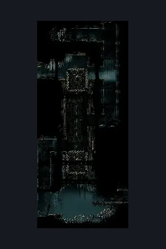
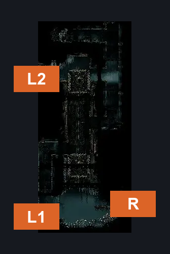
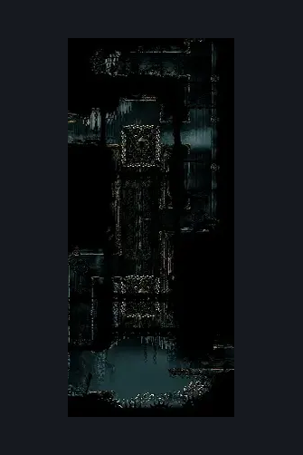

# Underworks Saw Shaft (Under_03c)

**Game ID:** Under_03c

**Contributors:** samupo

## Subrooms

| No. | Subroom | Annotated |
| --- | --- | --- |
| S1 | Top |  |
| S2 | Left |  |
| S3 | Right |  |

## Room Transitions

| Alias | Name | From subroom | Destination | Destination alias | Requirements | TODO | Verification | Annotated | Notes |
| --- | --- | --- | --- | --- | --- | --- | --- | --- | --- |
| L2 | left1 | Top | [Underworks Saw Intro (Under_03b)](underworks-saw-intro.md) | R | none |  |  | ✓ |  |
| L1 | left2 | Left | [Underworks Shard Room (Under_03)](underworks-shard-room.md) | R | none |  |  | ✓ |  |
| R | right1 | Right | [Underworks Crushing Path (Under_04)](underworks-crushing-path.md) | L | none |  |  | ✓ |  |

## Subroom Connections

| Alias | Name | Source | Destination | Requirements | TODO | Verification | Annotated | Notes |
| --- | --- | --- | --- | --- | --- | --- | --- | --- |
| H | Horizontal | Left | Right | dash OR clawline OR faydown cloak OR (spike pogo AND ledge grab) OR (drifter's cloak AND ledge grab) | TODO |  |  |  |
| H | Horizontal | Right | Left | dash OR clawline OR faydown cloak OR spike pogo OR drifter's cloak | TODO |  |  |  |
| V | Vertical | Top | Left | cling grip | TODO |  |  |  |
| V | Vertical | Left | Top | cling grip | TODO |  |  |  |

## Check Locations

No check locations defined.

## Room Images

### Scene

### Connections

### Checks

