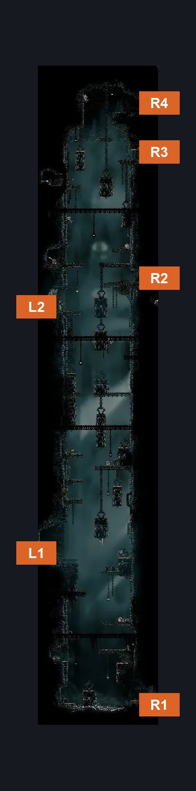
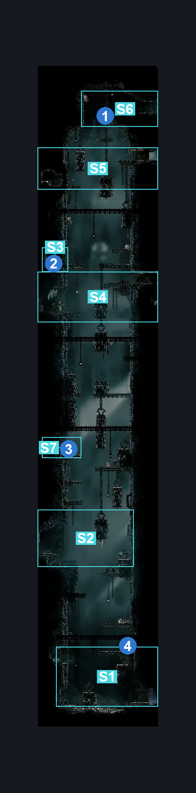
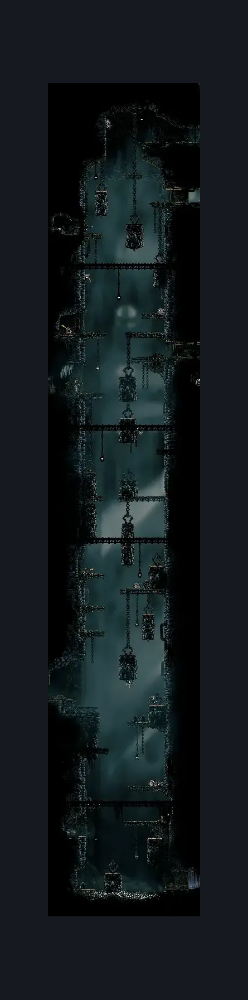

# Underworks Shaft (Under_02)

**Game ID:** Under_02

**Contributors:** samupo and Rebel

## Subrooms

| No. | Subroom | Annotated |
| --- | --- | --- |
| S1 | Underground | ✓ |
| S2 | Bottom | ✓ |
| S3 | Lever | ✓ |
| S4 | Mid | ✓ |
| S5 | Top | ✓ |
| S6 | Overtop | ✓ |
| S7 | Bottom Lever | ✓ |

## Room Transitions

| Alias | Name | From subroom | Destination | Destination alias | Requirements | TODO | Verification | Annotated | Notes |
| --- | --- | --- | --- | --- | --- | --- | --- | --- | --- |
| R4 | right1 | Overtop | [Underworks Outside Choral Chambers (Under_07c)](underworks-outside-choral-chambers.md) | L | none |  | Verified | ✓ |  |
| R3 | right2 | Top | [Underworks Western Gauntlet (Under_07)](underworks-western-gauntlet.md) | L | none |  | Verified | ✓ |  |
| R2 | right3 | Mid | [Underworks Saw Intro (Under_03b)](underworks-saw-intro.md) | L | none |  | Verified | ✓ |  |
| L2 | left3 | Mid | [Underworks Map Room (Under_16)](underworks-map-room.md) | R | none |  | Verified | ✓ |  |
| L1 | left1 | Bottom | [Broken Elevator (Under_01b)](broken-elevator.md) | R | Activate Elevator Bench Lever IN Broken Elevator |  | Verified | ✓ |  |
| R1 | right4 | Underground | [Underworks Delver's Drill (Under_14)](underworks-delver-s-drill.md) | L | Activate Underground Entrance Lever |  | Verified | ✓ |  |

## Subroom Connections

| Alias | Name | Source | Destination | Requirements | TODO | Verification | Annotated | Notes |
| --- | --- | --- | --- | --- | --- | --- | --- | --- |
| TOT | Top to Overtop | Overtop | Top | Nothing. (Fall) |  | Verified | ✓ |  |
| TOT | Top to Overtop | Top | Overtop | cling grip OR faydown cloak OR silk soar |  | Verified | ✓ |  |
| FT | Falling from Top | Top | Mid | Activate Platform Fall Lever |  | Verified | ✓ | falling |
| FT | Falling from Top | Mid | Top | Activate Platform Fall Lever AND (Silk Soar OR Cling Grip OR (Medium Scuttlebrace AND (Faydown Cloak OR Dash OR Clawline OR Sharpdart))) |  | Verified | ✓ |  |
| FT2 | Falling from Top 2 | Top | Lever | none (Fall) |  | Verified | ✓ |  |
| FT2 | Falling from Top 2 | Lever | Top | Silk Soar OR Cling Grip OR (Medium Scuttlebrace AND (Faydown Cloak OR Dash OR Clawline OR Sharpdart)) |  | Verified | ✓ |  |
| LM | Lever to Mid | Mid | Lever | Activate Platform Fall Lever |  | Verified | ✓ |  |
| LM | Lever to Mid | Lever | Mid | Activate Platform Fall Lever AND (Cling Grip OR Ledge Grab OR Faydown Cloak OR Silk Soar) |  | Verified | ✓ |  |
| MB | Mid <> Bottom | Mid | Bottom | Activate Platform Fall Lever |  | Verified | ✓ |  |
| MB | Mid <> Bottom | Bottom | Mid | Activate Platform Fall Lever AND (Cling Grip OR Ledge Grab OR Faydown Cloak OR Silk Soar) |  | Verified | ✓ |  |
| BL | Reaching Bottom Lever | Mid | Bottom Lever | Activate Platform Fall Lever |  | Verified | ✓ |  |
| BL | Reaching Bottom Lever | Bottom Lever | Mid | Activate Platform Fall Lever AND (silk soar OR Cling Grip OR Medium Scuttlebrace) |  | Verified | ✓ |  |
| RB | Reaching Bottom | Bottom Lever | Bottom | Nothing. (Fall) |  | Verified | ✓ |  |
| RB | Reaching Bottom | Bottom | Bottom Lever | Silk Soar OR Cling Grip OR (Medium Scuttlebrace AND (Ledge Grab OR Faydown Cloak)) |  | Verified | ✓ |  |
| UG | Underground | Bottom | Underground | Activate Platform Fall Lever |  | Verified | ✓ |  |
| UG | Underground | Underground | Bottom | Activate Platform Fall Lever AND (Cling Grip OR (Silk Soar AND (Faydown Cloak OR Sprint OR Dash OR Clawline OR Sharpdart OR Easy Scuttlebrace OR Easy Beast Pogo OR Easy Beast Charge OR Easy Architect Charge OR Flea Brew OR ((Easy Flintslate Stall OR Easy Plasmium Stall OR Easy Voltvessels Stall OR Easy Flea Brew Stall) AND Ledge Grab)))) |  | Verified | ✓ |  |

## Check Locations

| No. | Check | Subroom | Requirements | TODO | Verification | Location Type | Annotated | Notes |
| --- | --- | --- | --- | --- | --- | --- | --- | --- |
| 1 | Snapping Floor | Overtop | Break Wall Down |  | Verified | blockade | ✓ |  |
| 2 | Platform Fall Lever | Lever | Flip Switch Left |  | Verified | switch | ✓ |  |
| 3 | Unneeded Lever | Bottom Lever | Flip Switch Left |  | Verified | switch | ✓ |  |
| 4 | Underground Entrance Lever | Underground | Flip Switch Right |  | Verified | switch | ✓ |  |
| 5 | import enemies |  |  | TODO | Needs verification |  |  |  |

## Room Images

### Connections

### Checks

### Scene

