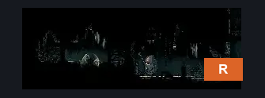
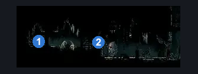
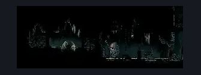

# Underworks Shard Room (Under_03)

**Game ID:** Under_03

**Contributors:** samupo

## Subrooms

No subrooms defined.

## Room Transitions

| Alias | Name | From subroom | Destination | Destination alias | Requirements | TODO | Verification | Annotated | Notes |
| --- | --- | --- | --- | --- | --- | --- | --- | --- | --- |
| R | right1 |  | [Underworks Saw Shaft (Under_03c)](underworks-saw-shaft.md) | L1 | none | TODO |  | ✓ |  |

## Subroom Connections

No subroom connections defined.

## Check Locations

| No. | Check | Subroom | Requirements | TODO | Verification | Location Type | Annotated | Notes |
| --- | --- | --- | --- | --- | --- | --- | --- | --- |
| 1 | Shard Bundle: Underworks #1 |  | proficient movement OR dash OR faydown cloak OR drifter's cloak OR spike pogo OR clawline OR sharpdart | TODO |  | collectible |  |  |

## Room Images

### Connections

### Checks

### Scene

