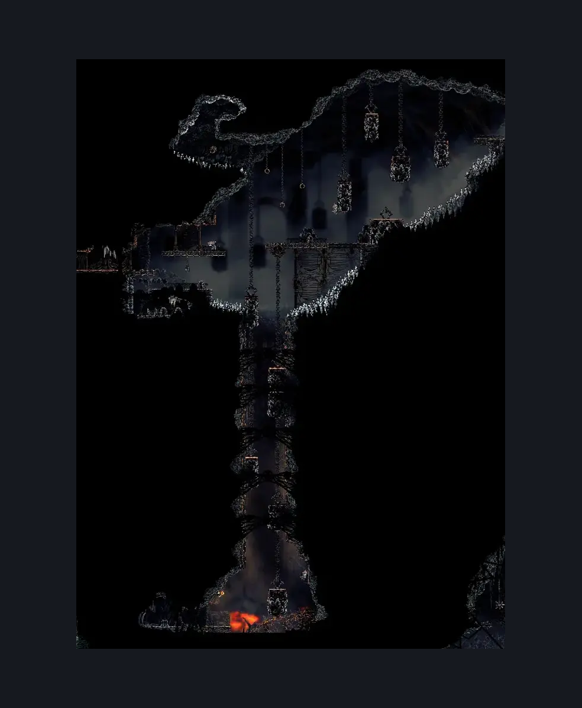
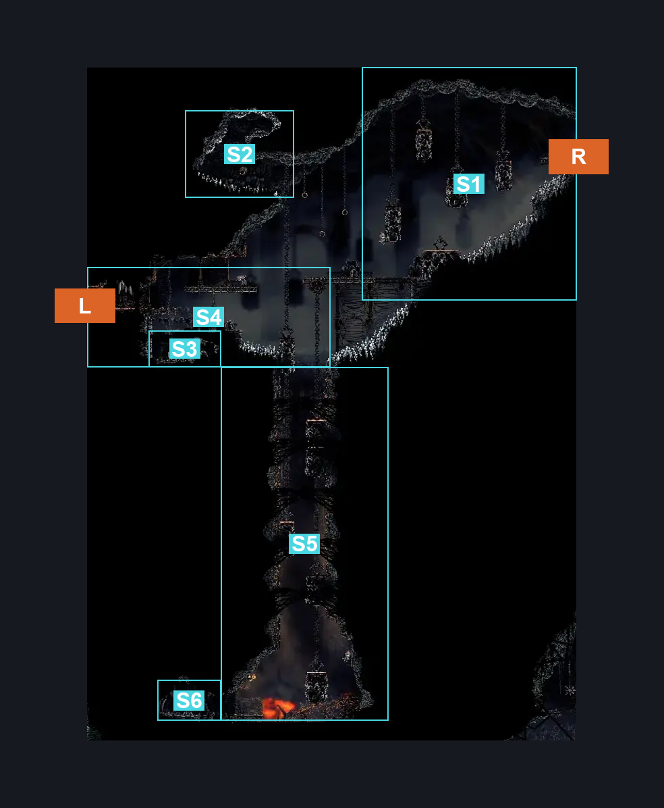
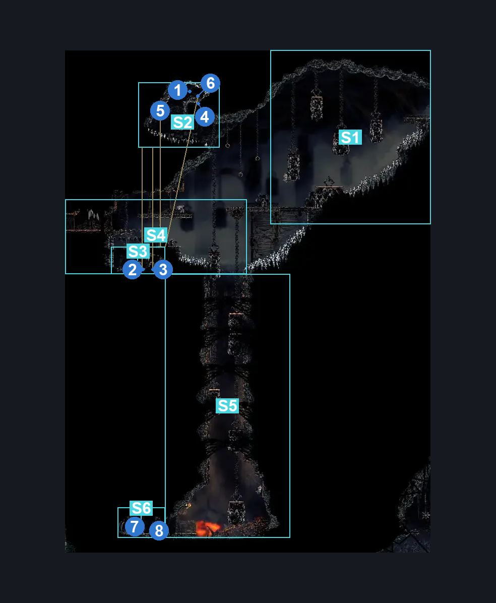

# Underworks Silk Spool (Library_11b)

**Game ID:** Library_11b

**Contributors:** Rebel

## Subrooms

| No. | Subroom | Annotated |
| --- | --- | --- |
| S1 | Upper Right | ✓ |
| S2 | Shell Shard Alcove #1 | ✓ |
| S3 | Shell Shard Alcove #2 | ✓ |
| S4 | Upper Left | ✓ |
| S5 | Bottom | ✓ |
| S6 | Silk Spool | ✓ |

## Room Transitions

| Alias | Name | From subroom | Destination | Destination alias | Requirements | TODO | Verification | Annotated | Notes |
| --- | --- | --- | --- | --- | --- | --- | --- | --- | --- |
| L | left3 | Upper Left | [Underworks Twelfth Architect (Under_17)](underworks-twelfth-architect.md) | FR | Nothing. |  | Verified | ✓ |  |
| R | right1 | Upper Right | [Vaults & Bellway Cauldron Entrance (Library_11)](vaults-bellway-cauldron-entrance.md) | LL | Nothing. |  | Verified | ✓ |  |

## Subroom Connections

| Alias | Name | Source | Destination | Requirements | TODO | Verification | Annotated | Notes |
| --- | --- | --- | --- | --- | --- | --- | --- | --- |
| RL | Right-Left | Upper Left | Upper Right | (Spike Pogo AND Ledge Grab) OR ((Sprint OR Dash OR Clawline OR Sharpdart) AND (Silk Soar OR Cling Grip OR Scuttlebrace OR (Faydown Cloak AND (Ledge Grab OR Clawline)))) |  | Verified |  |  |
| CS1 | Collect Shards #1 | Upper Right | Shell Shard Alcove #1 | (Faydown Cloak AND Drifter's Cloak AND Ledge Grab AND Spike Pogo) OR ((Cling Grip OR Scuttlebrace) AND (Clawline OR (Dash AND Sharpdart AND Spike Pogo AND Ledge Grab))) |  | Verified |  |  |
| CS2 | Collect Shards #2 | Upper Left | Shell Shard Alcove #2 | Nothing. (Fall) |  | Verified |  |  |
| CSS | Collect Silk Spool | Bottom | Silk Spool | Activate Underworks: Break Wall #3 |  | Verified |  |  |
| C | Climb | Upper Left | Bottom | Nothing. (Fall) |  | Verified |  |  |
| C | Climb | Bottom | Upper Left | Cling Grip OR (Scuttlebrace AND Faydown Cloak) |  | Verified |  |  |
| CS2 | Collect Shards #2 | Shell Shard Alcove #2 | Upper Left | Ledge Grab OR Clawline OR Cling Grip OR Scuttlebrace OR Faydown Cloak OR Silk Soar |  | Verified |  |  |
| CSS | Collect Silk Spool | Silk Spool | Bottom | ACtivate Underworks: Break Wall #3 |  | Verified |  |  |
| CS1 | Collect Shards #1 | Shell Shard Alcove #1 | Upper Right | Spike Pogo OR Dash OR Clawline OR Sharpdart OR Drifter's cloak OR Faydown Cloak OR Scuttlebrace |  | Verified |  |  |

## Check Locations

| No. | Check | Subroom | Requirements | TODO | Verification | Location Type | Annotated | Notes |
| --- | --- | --- | --- | --- | --- | --- | --- | --- |
| 1 | Underworks: Shell Shard Rock #3 | Shell Shard Alcove #1 | Nothing. |  | Verified | resource | ✓ |  |
| 2 | Underworks: Shell Shard Rock #4 | Shell Shard Alcove #1 | Nothing. |  | Verified | resource | ✓ |  |
| 3 | Underworks: Shell Shard Rock #5 | Shell Shard Alcove #1 | Nothing. |  | Verified | resource | ✓ |  |
| 4 | Underworks: Shell Shard Rock #6 | Shell Shard Alcove #1 | Nothing. |  | Verified | resource | ✓ |  |
| 5 | Underworks: Shell Shard Cache #2 | Shell Shard Alcove #2 | Nothing. |  | Verified | resource | ✓ |  |
| 6 | Underworks: Shell Shard Cache #3 | Shell Shard Alcove #2 | Nothing. |  | Verified | resource | ✓ |  |
| 7 | Underworks: Silk Spool Fragment #1 | Silk Spool | Nothing. |  | Verified | collectible | ✓ |  |
| 8 | Underworks: Break Wall #3 | Silk Spool | Break Wall Left |  | Verified | blockade | ✓ |  |

## Room Images

### Scene

### Connections

### Checks

