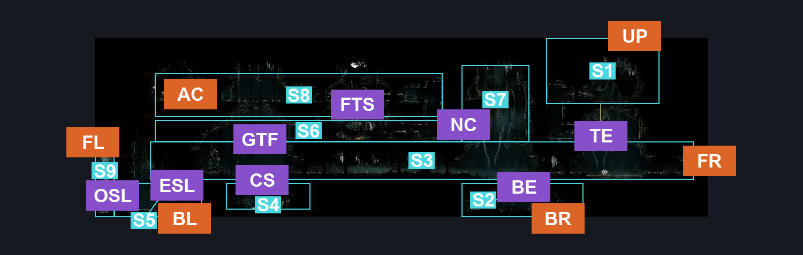
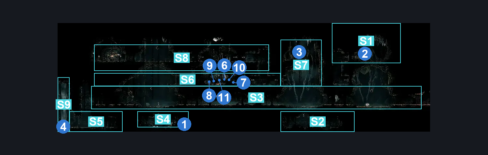
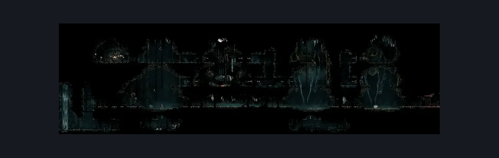

# Underworks Twelfth Architect (Under_17)

**Game ID:** Under_17

**Contributors:** Rebel

## Subrooms

| No. | Subroom | Annotated |
| --- | --- | --- |
| S1 | One-way Entrance (Top) | ✓ |
| S2 | One-way Entrance (Bottom) | ✓ |
| S3 | Ground Floor | ✓ |
| S4 | Shell Shard Cache | ✓ |
| S5 | Left Exit Bottom) | ✓ |
| S6 | First Floor | ✓ |
| S7 | Needolin Check Guy | ✓ |
| S8 | Second Floor | ✓ |
| S9 | Left Exit (Top) | ✓ |

## Room Transitions

| Alias | Name | From subroom | Destination | Destination alias | Requirements | TODO | Verification | Annotated | Notes |
| --- | --- | --- | --- | --- | --- | --- | --- | --- | --- |
| FL | Far Left | Left Exit (Top) | [Underworks East Shaft (Under_13)](underworks-east-shaft.md) | TR | Nothing. |  | Verified | ✓ |  |
| FR | Far Right | Ground Floor | [Underworks Silk Spool (Library_11b)](underworks-silk-spool.md) | L | Nothing. |  | Verified | ✓ |  |
| BL | Bottom Left | Left Exit Bottom) | [Underworks Clawline Room (Under_18)](underworks-clawline-room.md) | TL | Nothing. |  | Verified | ✓ |  |
| BR | Bottom Right | One-way Entrance (Bottom) | [Underworks Clawline Room (Under_18)](underworks-clawline-room.md) | TR | Nothing. |  | Verified | ✓ |  |
| UP | Upwards | One-way Entrance (Top) | [Whiteward Descent (Ward_06)](../whiteward/whiteward-descent.md) | B | Silk Soar. |  | Verified | ✓ |  |
| AC | Architect Chapel | Second Floor | [Chapel of the Architect (Under_20)](chapel-of-the-architect.md) | L | have Architect's Key |  | Verified | ✓ |  |

## Subroom Connections

| Alias | Name | Source | Destination | Requirements | TODO | Verification | Annotated | Notes |
| --- | --- | --- | --- | --- | --- | --- | --- | --- |
| GTF | Ground to First | Ground Floor | First Floor | Clawline OR (Faydown Cloak AND (Sprint OR Dash OR Sharp Dart) AND (Cling Grip OR Ledge Grab OR Scuttlebrace)) |  | Verified | ✓ |  |
| FTS | First to Second | First Floor | Second Floor | Silk Soar OR (Faydown Cloak AND (Ledge Grab OR Clawline)) OR Cling Grip OR Scuttlebrace |  | Verified | ✓ |  |
| NC | Needolin Check | First Floor | Needolin Check Guy | Silk Soar OR (Faydown Cloak AND (Ledge Grab OR Clawline)) OR Cling Grip OR Scuttlebrace |  | Verified | ✓ | same requirements lmao |
| NC | Needolin Check | Needolin Check Guy | First Floor | Nothing. (Fall) |  | Verified | ✓ |  |
| FTS | First to Second | Second Floor | First Floor | Nothing. (Fall) |  | Verified | ✓ |  |
| GTF | Ground to First | First Floor | Ground Floor | Nothing. (Fall) |  | Verified | ✓ |  |
| TE | Top Entrance | One-way Entrance (Top) | Ground Floor | Nothing. (Fall) |  | Verified | ✓ |  |
| BE | Bottom Entrance | One-way Entrance (Bottom) | Ground Floor | Silk Soar OR (Faydown Cloak AND (Ledge Grab OR Clawline)) OR Cling Grip OR Scuttlebrace |  | Verified | ✓ |  |
| TE | Top Entrance | Ground Floor | One-way Entrance (Top) | invalid |  | Verified | ✓ |  |
| BE | Bottom Entrance | Ground Floor | One-way Entrance (Bottom) | invalid |  | Verified | ✓ |  |
| CS | Collect Shards | Ground Floor | Shell Shard Cache | Nothing. (Fall) |  | Verified | ✓ |  |
| CS | Collect Shards | Shell Shard Cache | Ground Floor | Silk Soar OR (Faydown Cloak AND (Ledge Grab OR Clawline)) OR Cling Grip OR Scuttlebrace |  | Verified | ✓ | LOTTA this in this room. |
| ESL | Exit Stage Left | Ground Floor | Left Exit Bottom) | Nothing. (Fall) |  | Verified | ✓ |  |
| ESL | Exit Stage Left | Left Exit Bottom) | Ground Floor | Silk Soar OR (Faydown Cloak AND (Ledge Grab OR Clawline)) OR Cling Grip OR Scuttlebrace |  | Verified | ✓ |  |
| OSL | ...Other Stage Left | Left Exit Bottom) | Left Exit (Top) | Silk Soar OR (Faydown Cloak AND (Cling Grip OR Scuttlebrace)) OR (Drifter's Cloak AND Activate Underworks Architect Forge Fan Lever) |  | Verified | ✓ |  |
| OSL | ...Other Stage Left | Left Exit (Top) | Left Exit Bottom) | Nothing. (Fall) |  | Verified | ✓ |  |

## Check Locations

| No. | Check | Subroom | Requirements | TODO | Verification | Location Type | Annotated | Notes |
| --- | --- | --- | --- | --- | --- | --- | --- | --- |
| 1 | Underworks: Shell Shard Cache #4 | Shell Shard Cache | Nothing. |  | Verified | collectible | ✓ |  |
| 2 | Underworks: Needolin Lore #2 | One-way Entrance (Top) | Needolin |  | Verified | lore | ✓ | futureproofing in case |
| 3 | Underworks: Needolin Lore #3 | Needolin Check Guy | Needolin |  | Verified | lore | ✓ | futureproofing in case |
| 4 | Underworks Architect Forge Fan Lever | Left Exit (Top) | Flip Switch Left OR Flip Switch Right |  | Verified | switch | ✓ |  |
| 5 | Twelfth Architect: Silkshot | First Floor | have Ruined Tool  AND Spend 1 Craftmetals |  | Verified | collectible |  |  |
| 6 | Twelfth Architect: Cogwork Wheel | First Floor | Spend 1 Craftmetals |  | Verified | collectible | ✓ |  |
| 7 | Twelfth Architect: Sawtooth Circlet | First Floor | Spend 1 Craftmetals |  | Verified | collectible | ✓ |  |
| 8 | Twelfth Architect: Scuttlebrace | First Floor | Spend 1 Craftmetals |  | Verified | collectible | ✓ |  |
| 9 | Twelfth Architect: Crafting Kit | First Floor | Nothing. |  | Verified | collectible | ✓ |  |
| 10 | Twelfth Architect: Architect's Key | First Floor | Get 25 Tools |  | Verified | collectible | ✓ |  |
| 11 | Twelfth Architect Pristine Core | First Floor | Have Architect's Melody AND Unlock Twelfth Architect: Cogwork Wheel  AND Unlock Twelfth Architect: Sawtooth Circlet  AND Unlock Twelfth Architect: Scuttlebrace  AND Unlock Twelfth Architect: Crafting Kit  AND Unlock Twelfth Architect: Architect's Key |  | Verified | collectible | ✓ | is this really nothing? - hero, 9/25 uhhhhh, no. i am have stupid and wrote that on autopilot - rebel, 10/2 |

## Room Images

### Connections

### Checks

### Scene

