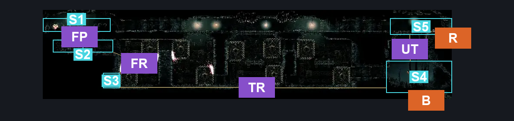
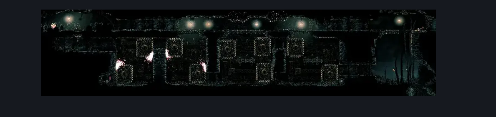

# Underworks Wisp Thicket Passage (Under_23)

**Game ID:** Under_23

**Contributors:** samupo and Rebel

## Subrooms

| No. | Subroom | Annotated |
| --- | --- | --- |
| S1 | Flea | ✓ |
| S2 | Lower Flea Corridor | ✓ |
| S3 | Rosary String | ✓ |
| S4 | Wisp Thicket Entrance | ✓ |
| S5 | Underworks Entrance | ✓ |

## Room Transitions

| Alias | Name | From subroom | Destination | Destination alias | Requirements | TODO | Verification | Annotated | Notes |
| --- | --- | --- | --- | --- | --- | --- | --- | --- | --- |
| R | right1 | Underworks Entrance | [Underworks Central Shaft (Under_05)](underworks-central-shaft.md) | WT | nothing |  | Verified | ✓ |  |
| B | bot1 | Wisp Thicket Entrance | [Wisp Thicket Cave (Wisp_09)](../wisp-thicket/wisp-thicket-cave.md) | T | Nada |  | Verified | ✓ |  |

## Subroom Connections

| Alias | Name | Source | Destination | Requirements | TODO | Verification | Annotated | Notes |
| --- | --- | --- | --- | --- | --- | --- | --- | --- |
| FP | Flea Passage | Lower Flea Corridor | Flea | Open Airlock Up AND (Cling Grip OR Scuttlebrace OR Faydown Cloak) |  | Verified | ✓ |  |
| FP | Flea Passage | Flea | Lower Flea Corridor | Open Airlock Down |  | Verified | ✓ |  |
| FR | Flea <> Rosary | Lower Flea Corridor | Rosary String | (Swift Step 2 AND Faydown Cloak) OR Clawline OR Sharpdart OR Drifter's Cloak |  | Verified | ✓ | this room is hell |
| FR | Flea <> Rosary | Rosary String | Lower Flea Corridor | Cling Grip OR Scuttlebrace |  | Verified | ✓ |  |
| TF | Thicket <> Flea | Wisp Thicket Entrance | Lower Flea Corridor | (Cling Grip AND (Dash OR Faydown Cloak OR Drifter's Cloak OR Clawline)) OR (Medium Scuttlebrace AND ((Faydown Cloak AND Drifter's Cloak) OR Clawline)) |  | Verified |  |  |
| TF | Thicket <> Flea | Lower Flea Corridor | Wisp Thicket Entrance | (Cling Grip AND (Dash OR Faydown Cloak OR Drifter's Cloak OR Clawline)) OR (Medium Scuttlebrace AND ((Faydown Cloak AND Drifter's Cloak) OR Clawline)) |  | Verified |  |  |
| UF | Underworks <> Flea | Underworks Entrance | Flea | Nothing. |  | Verified |  |  |
| UF | Underworks <> Flea | Flea | Underworks Entrance | Nothing. |  | Verified |  |  |
| UT | Underworks <> Wisp Thicket | Underworks Entrance | Wisp Thicket Entrance | Activate Hell Skip Lever |  | Verified | ✓ |  |
| UT | Underworks <> Wisp Thicket | Wisp Thicket Entrance | Underworks Entrance | (Activate Hell Skip Lever AND (Silk Soar OR (Cling Grip AND (Faydown Cloak OR Dash OR Clawline OR Sharpdart OR Easy Architect Charge OR Easy Beast Charge OR Easy Beast Pogo OR Easy Voltvessels Stall OR Medium Flintslate Stall OR Flea Brew OR Easy Flea Brew Stall OR Easy Plasmium Stall)) OR (Scuttlebrace AND (Faydown Cloak OR Clawline OR Sharpdart)))) |  | Verified | ✓ |  |
| TR | Wisp Thicket <> Rosary | Wisp Thicket Entrance | Rosary String | (Cling Grip AND (Dash OR Faydown Cloak OR Drifter's Cloak OR Clawline)) OR (Medium Scuttlebrace AND ((Faydown Cloak AND Drifter's Cloak) OR Clawline)) |  | Verified | ✓ |  |
| TR | Wisp Thicket <> Rosary | Rosary String | Wisp Thicket Entrance | (Cling Grip AND (Dash OR Faydown Cloak OR Drifter's Cloak OR Clawline)) OR (Medium Scuttlebrace AND ((Faydown Cloak AND Drifter's Cloak) OR Clawline)) |  | Verified | ✓ |  |

## Check Locations

| No. | Check | Subroom | Requirements | TODO | Verification | Location Type | Annotated | Notes |
| --- | --- | --- | --- | --- | --- | --- | --- | --- |
| 1 | Rosary Cache: Underworks #13 | Rosary String | Nothing |  | Verified | collectible | ✓ |  |
| 2 | Flea: Underworks - Wisp Thicket Passage | Flea | nada |  | Verified | collectible | ✓ |  |
| 3 | Hell Skip Lever | Underworks Entrance | Flip Switch Left OR Flip Switch Right |  | Verified | switch | ✓ |  |
| 4 | import enemies |  |  | TODO | Needs verification |  |  |  |

## Room Images

### Connections

### Checks

### Scene

