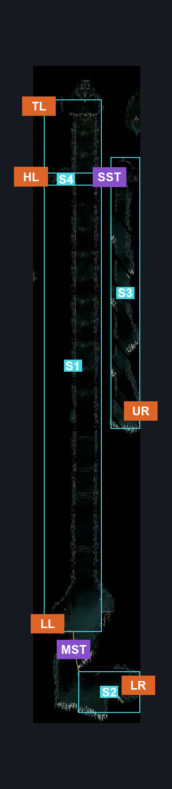
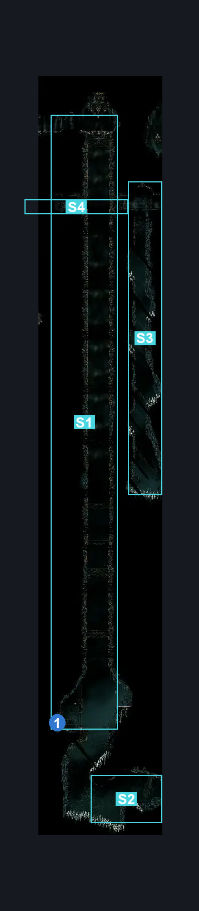
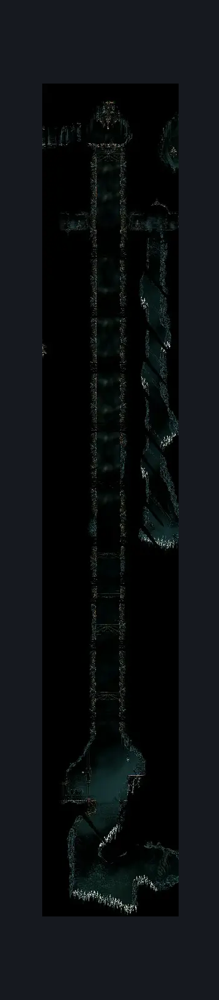

# Vaults & Bellway Cauldron Entrance (Library_11)

**Game ID:** Library_11

**Contributors:** Rebel

## Subrooms

| No. | Subroom | Annotated |
| --- | --- | --- |
| S1 | Elevator Shaft | ✓ |
| S2 | Bottom Exit | ✓ |
| S3 | Side Shaft Bottom Exit | ✓ |
| S4 | Side Shaft Top Exit | ✓ |

## Room Transitions

| Alias | Name | From subroom | Destination | Destination alias | Requirements | TODO | Verification | Annotated | Notes |
| --- | --- | --- | --- | --- | --- | --- | --- | --- | --- |
| TL | Top Left | Elevator Shaft | [Trobbio (Library_13)](../whispering-vaults/trobbio.md) | BR | Nothing. |  | Verified | ✓ |  |
| HL | High Left | Side Shaft Top Exit | [Grand Bellway (Bellway_City)](../choral-chambers/grand-bellway.md) | R | Nothing. |  | Verified | ✓ |  |
| LR | Low Right | Bottom Exit | [Underworks Exhaust Organ Transit (Library_12)](underworks-exhaust-organ-transit.md) | LL | Nothing. |  | Verified | ✓ |  |
| LL | Low Left | Elevator Shaft | [Underworks Silk Spool (Library_11b)](underworks-silk-spool.md) | R | Activate Underworks Elevator Door Switch |  | Verified | ✓ |  |
| UR | Upper Right | Side Shaft Bottom Exit | [Underworks Exhaust Organ Transit (Library_12)](underworks-exhaust-organ-transit.md) | UL | Nothing. |  | Verified | ✓ |  |

## Subroom Connections

| Alias | Name | Source | Destination | Requirements | TODO | Verification | Annotated | Notes |
| --- | --- | --- | --- | --- | --- | --- | --- | --- |
| SST | Side Shaft Traversal | Side Shaft Bottom Exit | Side Shaft Top Exit | Cling Grip OR (Scuttlebrace AND Spike Pogo) |  | Verified | ✓ |  |
| SST | Side Shaft Traversal | Side Shaft Top Exit | Side Shaft Bottom Exit | Nothing. (Fall) |  | Verified | ✓ |  |
| MST | Main Shaft Traversal | Elevator Shaft | Bottom Exit | Spike Pogo OR (Cling Grip AND (Faydown Cloak OR Drifter's Cloak OR Dash OR Clawline OR Sharp Dart)) OR (Hard Scuttlebrace AND (Clawline OR (Faydown Cloak AND Drifter's Cloak))) |  | Verified | ✓ |  |
| MST | Main Shaft Traversal | Bottom Exit | Elevator Shaft | Cling Grip AND (Drifter's Cloak OR Clawline OR Sharp Dart OR Spike Pogo) |  | Verified | ✓ | requires the elevator be moved up, but seeing as its a permanently available toggle i dont think i need to state that |

## Check Locations

| No. | Check | Subroom | Requirements | TODO | Verification | Location Type | Annotated | Notes |
| --- | --- | --- | --- | --- | --- | --- | --- | --- |
| 1 | Underworks Elevator Door Switch | Elevator Shaft | Flip Switch Left |  | Verified | switch | ✓ |  |

## Notes

Side Shaft and Elevator Shaft do not connect.

## Room Images

### Connections

### Checks

### Scene

