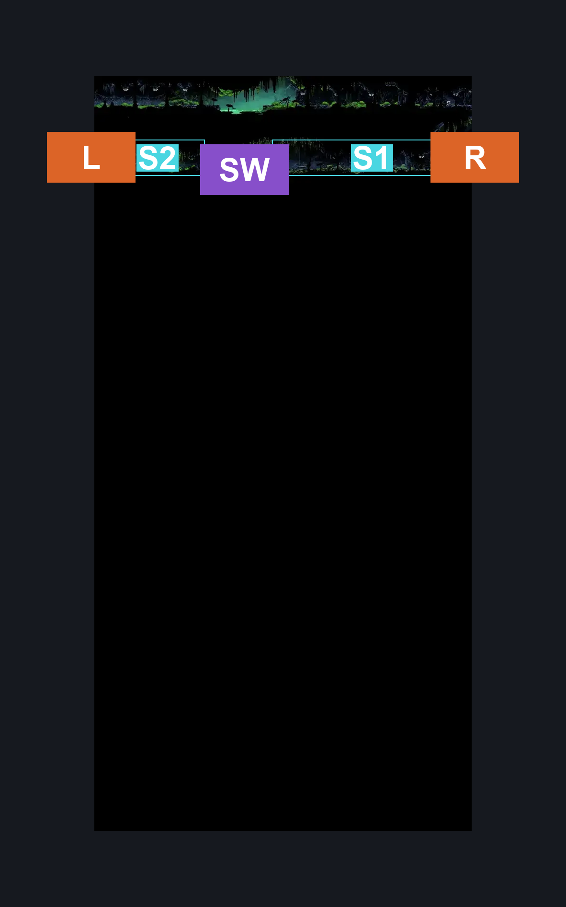

# Weavenest Atla Bench (Weave_07)

**Game ID:** Weave_07

**Contributors:** herounit

## Subrooms

| No. | Subroom | Annotated |
| --- | --- | --- |
| S1 | bench area | ✓ |
| S2 | left exit area | ✓ |

## Room Transitions

| Alias | Name | From subroom | Destination | Destination alias | Requirements | TODO | Verification | Annotated | Notes |
| --- | --- | --- | --- | --- | --- | --- | --- | --- | --- |
| R | right | bench area | [Weavenest Atla Teleporter (Weave_02)](weavenest-atla-teleporter.md) | LL | none |  | Verified | ✓ |  |
| L | left | left exit area | [Weavenest Atla Grotto (Weave_03)](weavenest-atla-grotto.md) | R | none |  | Verified | ✓ |  |

## Subroom Connections

| Alias | Name | Source | Destination | Requirements | TODO | Verification | Annotated | Notes |
| --- | --- | --- | --- | --- | --- | --- | --- | --- |
| SW | swim | bench area | left exit area | swim |  | Verified | ✓ | there is a slim possibility clawline and cling grip could work here, but can't test until swim is randomized |
| SW | swim | left exit area | bench area | swim |  | Verified | ✓ |  |

## Check Locations

| No. | Check | Subroom | Requirements | TODO | Verification | Location Type | Annotated | Notes |
| --- | --- | --- | --- | --- | --- | --- | --- | --- |
| 1 | bench | bench area | none |  | Verified | bench | ✓ |  |

## Room Images

### Scene

### Connections

### Checks

