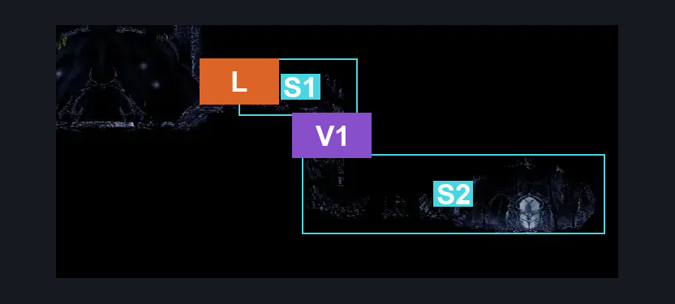
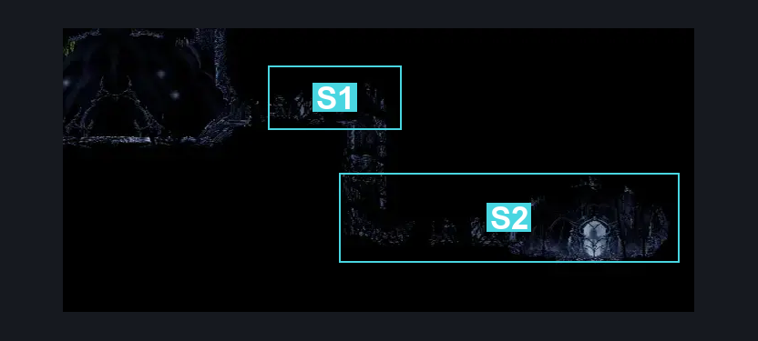
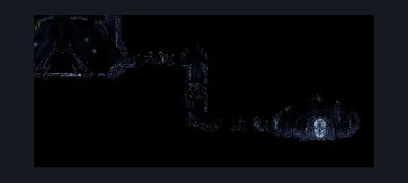

# Weavenest Atla Eva (Weave_10)

**Game ID:** Weave_10

**Contributors:** herounit

## Subrooms

| No. | Subroom | Annotated |
| --- | --- | --- |
| S1 | left exit area | ✓ |
| S2 | eva pod | ✓ |

## Room Transitions

| Alias | Name | From subroom | Destination | Destination alias | Requirements | TODO | Verification | Annotated | Notes |
| --- | --- | --- | --- | --- | --- | --- | --- | --- | --- |
| L | left | left exit area | [Weavenest Atla Teleporter (Weave_02)](weavenest-atla-teleporter.md) | LR | none |  | Verified | ✓ |  |

## Subroom Connections

| Alias | Name | Source | Destination | Requirements | TODO | Verification | Annotated | Notes |
| --- | --- | --- | --- | --- | --- | --- | --- | --- |
| V1 | vertical 1 | left exit area | eva pod | break wall right AND break wall down |  | Verified | ✓ |  |
| V1 | vertical 1 | eva pod | left exit area | break wall left AND break wall up AND ( cling grip OR silk soar OR scuttlebrace ) |  | Verified | ✓ |  |

## Check Locations

| No. | Check | Subroom | Requirements | TODO | Verification | Location Type | Annotated | Notes |
| --- | --- | --- | --- | --- | --- | --- | --- | --- |
| 1 | crest of the hunter | eva pod | none |  | Verified | collectible |  | per a random reddit thread |
| 2 | yellow vesticrest | eva pod | get 12 tool slots unlocked |  | Verified | collectible |  | per a random reddit thread |
| 3 | blue vesticrest | eva pod | get 20 tool slots unlocked |  | Verified | collectible |  | per a random reddit thread |
| 4 | crest of the hunter 2 | eva pod | get 27 tool slots unlocked |  | Verified | collectible |  | per a random reddit thread |
| 5 | sylphsong | eva pod | get 32 tool slots unlocked |  | Verified | collectible |  | per a random reddit thread |

## Room Images

### Connections

### Checks

### Scene

