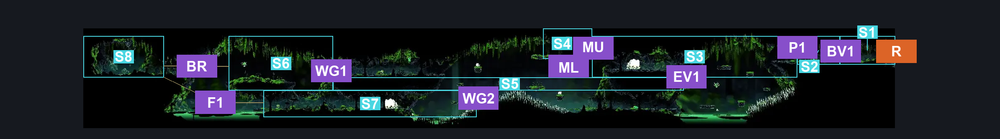
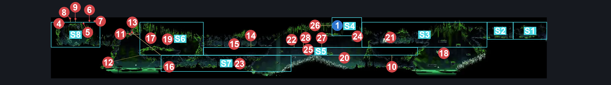
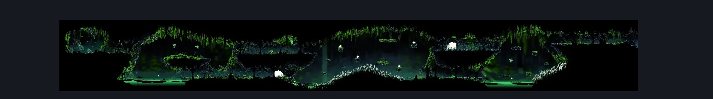

# Weavenest Atla Grotto (Weave_03)

**Game ID:** Weave_03

**Contributors:** herounit

## Subrooms

| No. | Subroom | Annotated |
| --- | --- | --- |
| S1 | right exit area | ✓ |
| S2 | far east platforms | ✓ |
| S3 | upper east platforms | ✓ |
| S4 | mossberry platform | ✓ |
| S5 | causeway | ✓ |
| S6 | upper west platforms | ✓ |
| S7 | lower west platforms | ✓ |
| S8 | boss room | ✓ |

## Room Transitions

| Alias | Name | From subroom | Destination | Destination alias | Requirements | TODO | Verification | Annotated | Notes |
| --- | --- | --- | --- | --- | --- | --- | --- | --- | --- |
| R | right | right exit area | [Weavenest Atla Bench (Weave_07)](weavenest-atla-bench.md) | L | break vines right |  | Verified | ✓ |  |

## Subroom Connections

| Alias | Name | Source | Destination | Requirements | TODO | Verification | Annotated | Notes |
| --- | --- | --- | --- | --- | --- | --- | --- | --- |
| BV1 | break vines 1 | right exit area | far east platforms | break vines left |  | Verified | ✓ |  |
| BV1 | break vines 1 | far east platforms | right exit area | break vines right |  | Verified | ✓ |  |
| P1 | platforming 1 | far east platforms | upper east platforms | none (falling) |  | Verified | ✓ |  |
| P1 | platforming 1 | upper east platforms | far east platforms | ledge grab OR run OR dash OR drifter's cloak OR faydown cloak OR clawline OR scuttlebrace OR sharpdart OR easy shaman pogo |  | Verified | ✓ |  |
| MU | mossberry upper | upper east platforms | mossberry platform | run OR dash OR drifter's cloak OR faydown cloak OR sharpdart OR clawline OR easy beast pogo OR ( ledge grab AND ( easy shaman pogo OR easy architect pogo ) ) |  | Verified | ✓ | other stall techniques may also make it - untested; was unable to replicate previous reaper pogo |
| ML | mossberry lower | causeway | mossberry platform | silk soar |  | Verified | ✓ |  |
| ML | mossberry lower | mossberry platform | causeway | none (falling) |  | Verified | ✓ |  |
| EV1 | east vertical 1 | causeway | upper east platforms | ledge grab OR faydown cloak OR   silk soar |  | Verified | ✓ |  |
| EV1 | east vertical 1 | upper east platforms | causeway | none (falling) |  | Verified | ✓ |  |
| WG1 | west gap 1 | causeway | upper west platforms | none (falling) |  | Verified | ✓ |  |
| WG1 | west gap 1 | upper west platforms | causeway | ledge grab OR run OR dash OR drifter's cloak OR faydown cloak OR silk soar OR clawline OR sharpdart OR scuttlebrace |  | Verified | ✓ |  |
| WG2 | west gap 2 | lower west platforms | causeway | ledge grab OR faydown cloak OR spike pogo OR silk soar |  | Verified | ✓ |  |
| WG2 | west gap 2 | causeway | lower west platforms | none (falling) |  | Verified | ✓ |  |
| BR | boss room jump | upper west platforms | boss room | break vines left AND ( run OR dash OR drifter's cloak OR faydown cloak OR sharpdart OR clawline OR easy beast pogo ) |  | Verified | ✓ | beast pogo clears this easily |
| BR | boss room jump | boss room | upper west platforms | break vines right AND ( run OR dash OR drifter's cloak OR faydown cloak OR sharpdart OR clawline OR scuttlebrace OR easy beast pogo ) |  | Verified | ✓ |  |
| F1 | fall 1 | boss room | lower west platforms | none (falling) |  | Verified | ✓ |  |

## Check Locations

| No. | Check | Subroom | Requirements | TODO | Verification | Location Type | Annotated | Notes |
| --- | --- | --- | --- | --- | --- | --- | --- | --- |
| 1 | weavenest atla mossberry | mossberry platform | none |  | Verified | collectible | ✓ |  |
| 2 | double moss mother boss fight | boss room | None |  | Verified | boss |  | BOSS IS NOT CURRENTLY TIED TO A CHECK - but does unlock weavelight check |
| 3 | weavelight | boss room | complete double moss mother boss fight |  | Verified | collectible |  |  |
| 4 | Moss Mother A | boss room | None |  | Verified | enemy | ✓ | individual moss mother |
| 5 | Moss Mother B | boss room | None |  | Verified | enemy | ✓ | individual moss mother |
| 6 | Mossgrub Summon 1 | boss room | Invalid |  | Verified | enemy | ✓ | boss summon - not a guaranteed spawn |
| 7 | Mossgrub Summon 2 | boss room | Invalid |  | Verified | enemy | ✓ | boss summon - not a guaranteed spawn |
| 8 | Mossgrub Summon 3 | boss room | Invalid |  | Verified | enemy | ✓ | boss summon - not a guaranteed spawn |
| 9 | Mossgrub Summon 4 | boss room | Invalid |  | Verified | enemy | ✓ | boss summon - not a guaranteed spawn |
| 10 | Mossgrub 5 | causeway | None |  | Verified | enemy | ✓ |  |
| 11 | MossBone Cocoon (6) | upper west platforms | None |  | Verified | enemy | ✓ |  |
| 12 | MossBone Cocoon (5) | upper west platforms | Swim |  | Verified | enemy | ✓ |  |
| 13 | MossBone Cocoon (4) | lower west platforms | None |  | Verified | enemy | ✓ |  |
| 14 | Mossgrub 6 | causeway | None |  | Verified | enemy | ✓ |  |
| 15 | Servitor Ignim 1 | causeway | None |  | Verified | enemy | ✓ |  |
| 16 | Servitor Ignim 2 | lower west platforms | None |  | Verified | enemy | ✓ |  |
| 17 | Mossmir 1 | upper west platforms | None |  | Verified | enemy | ✓ |  |
| 18 | Mossmir 2 | upper east platforms | None |  | Verified | enemy | ✓ |  |
| 19 | Mossmir 3 | upper west platforms | None |  | Verified | enemy | ✓ |  |
| 20 | Mawling 1 | causeway | None |  | Verified | enemy | ✓ |  |
| 21 | Marrowmaw 1 | upper east platforms | None |  | Verified | enemy | ✓ |  |
| 22 | Mawling 2 | causeway | None |  | Verified | enemy | ✓ |  |
| 23 | Marrowmaw 2 | lower west platforms | None |  | Verified | enemy | ✓ |  |
| 24 | Mawling 3 | upper east platforms | None |  | Verified | enemy | ✓ |  |
| 25 | Mawling 4 | causeway | Normal World Spawn |  | Verified | enemy | ✓ |  |
| 26 | Void Mass 1 | mossberry platform | Black Thread World Spawn |  | Verified | enemy | ✓ |  |
| 27 | Mossmir 4 | causeway | Black Thread World Spawn |  | Verified | enemy | ✓ |  |
| 28 | Mossmir 5 | causeway | Black Thread World Spawn |  | Verified | enemy | ✓ |  |

## Room Images

### Connections

### Checks

### Scene

