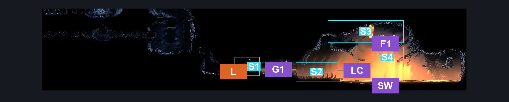
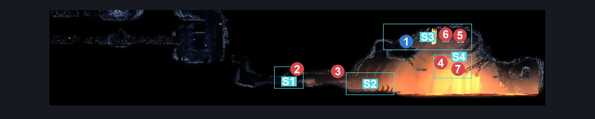
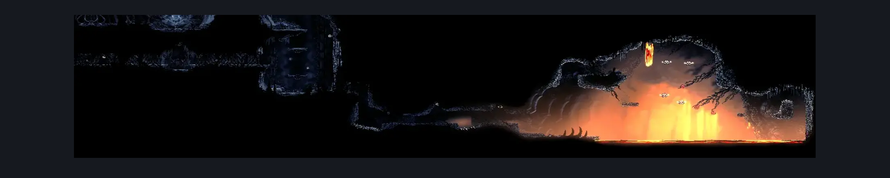

# Weavenest Atla Mask Shard (Weave_05b)

**Game ID:** Weave_05b

**Contributors:** herounit

## Subrooms

| No. | Subroom | Annotated |
| --- | --- | --- |
| S1 | left exit area | ✓ |
| S2 | starting line | ✓ |
| S3 | mask shard spot | ✓ |
| S4 | lower skullwing spot | ✓ |

## Room Transitions

| Alias | Name | From subroom | Destination | Destination alias | Requirements | TODO | Verification | Annotated | Notes |
| --- | --- | --- | --- | --- | --- | --- | --- | --- | --- |
| L | left | left exit area | [Weavenest Atla Lore (Weave_08)](weavenest-atla-lore.md) | R | none |  | Verified | ✓ |  |

## Subroom Connections

| Alias | Name | Source | Destination | Requirements | TODO | Verification | Annotated | Notes |
| --- | --- | --- | --- | --- | --- | --- | --- | --- |
| G1 | gap 1 | left exit area | starting line | spike pogo OR run OR dash OR drifter's cloak OR faydown cloak OR cling grip OR clawline OR sharpdart |  | Verified | ✓ |  |
| G1 | gap 1 | starting line | left exit area | spike pogo OR run OR dash OR drifter's cloak OR faydown cloak OR cling grip OR clawline OR sharpdart |  | Verified | ✓ |  |
| LC | lava challenge | starting line | mask shard spot | silk soar  OR medium scuttlebrace OR ( ( cling grip OR scuttlebrace ) AND ( dash OR drifter's cloak OR faydown cloak OR clawline OR sharpdart ) ) |  | Verified | ✓ | the scuttlebrace-only tech allows this to be done without anything else, but I would personally consider it medium because of the timing and control requirements w/ lava damage for mistakes |
| LC | lava challenge | mask shard spot | starting line | none (falling) |  | Verified | ✓ |  |
| SW | skullwing access | starting line | lower skullwing spot | ( faydown AND ledge grab )  OR ( ( cling grip OR scuttlebrace ) AND ( run OR dash OR clawline OR drifters OR faydown OR sharpdart ) ) |  | Verified | ✓ |  |
| F1 | fall 1 | mask shard spot | lower skullwing spot | none (falling) |  | Verified | ✓ | so silk soar is a viable option to get here too |

## Check Locations

| No. | Check | Subroom | Requirements | TODO | Verification | Location Type | Annotated | Notes |
| --- | --- | --- | --- | --- | --- | --- | --- | --- |
| 1 | weavenest alta mask shard | mask shard spot | none |  | Verified | collectible | ✓ |  |
| 2 | Pharlid Diver 1 | left exit area | None |  | Verified | enemy | ✓ |  |
| 3 | Pharlid Diver 2 | starting line | None |  | Verified | enemy | ✓ |  |
| 4 | Skullwing 1 | lower skullwing spot | None |  | Verified | enemy | ✓ |  |
| 5 | Skullwing 2 | mask shard spot | None |  | Verified | enemy | ✓ |  |
| 6 | Skullwing 3 | mask shard spot | None |  | Verified | enemy | ✓ |  |
| 7 | Skullwing 4 | lower skullwing spot | None |  | Verified | enemy | ✓ | can be accessed if you can reach the mask shard spot for the most part |

## Room Images

### Connections

### Checks

### Scene

