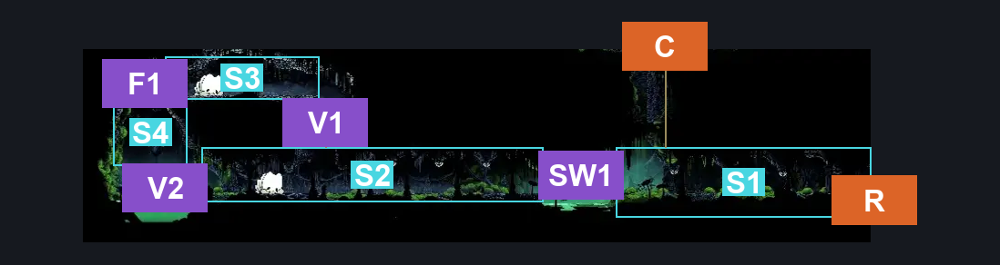
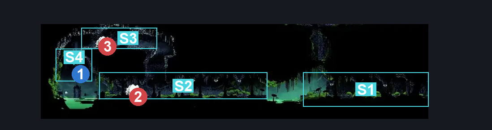
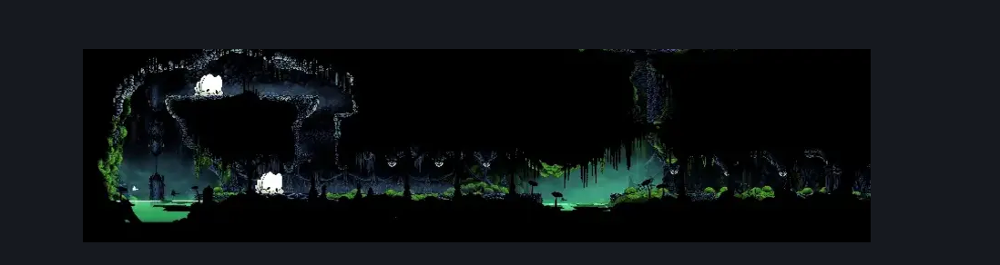

# Weavenest Atla Spool (Weave_11)

**Game ID:** Weave_11

**Contributors:** herounit

## Subrooms

| No. | Subroom | Annotated |
| --- | --- | --- |
| S1 | right exit area | ✓ |
| S2 | mid passage | ✓ |
| S3 | upper left passage | ✓ |
| S4 | spool spot | ✓ |

## Room Transitions

| Alias | Name | From subroom | Destination | Destination alias | Requirements | TODO | Verification | Annotated | Notes |
| --- | --- | --- | --- | --- | --- | --- | --- | --- | --- |
| R | right | right exit area | [Weavenest Atla Teleporter (Weave_02)](weavenest-atla-teleporter.md) | ML | none |  | Verified | ✓ |  |
| C | ceiling | right exit area | [Weavenest Atla Snare (Weave_14)](weavenest-atla-snare.md) | F | silk soar OR ( faydown cloak AND ( cling grip OR scuttlebrace ) ) |  | Verified | ✓ |  |

## Subroom Connections

| Alias | Name | Source | Destination | Requirements | TODO | Verification | Annotated | Notes |
| --- | --- | --- | --- | --- | --- | --- | --- | --- |
| SW1 | swim 1 | right exit area | mid passage | swim  OR clawline  OR sharpdart  OR faydown cloak  OR ( ( ledge grab OR cling grip ) AND ( dash OR drifter's cloak ) )  OR ( easy beast pogo AND ( dash OR run OR drifter's cloak ) ) OR ( dash AND ( run OR drifter's cloak ) ) |  | Verified | ✓ |  |
| SW1 | swim 1 | mid passage | right exit area | swim OR clawline OR sharpdart OR ( ( ledge grab OR cling grip ) AND ( drifter's cloak OR faydown cloak OR ( dash AND run ) ) ) OR ( easy beast pogo AND dash ) |  | Verified | ✓ |  |
| V1 | vertical 1 | mid passage | upper left passage | ledge grab OR faydown cloak OR cling grip OR scuttlebrace |  | Verified | ✓ |  |
| V1 | vertical 1 | upper left passage | mid passage | none (falling) |  | Verified | ✓ |  |
| F1 | fall 1 | upper left passage | spool spot | none (falling) |  | Verified | ✓ |  |
| V2 | vertical 2 | mid passage | spool spot | faydown cloak |  | Verified | ✓ |  |
| V2 | vertical 2 | spool spot | mid passage | none (falling) |  | Verified | ✓ |  |

## Check Locations

| No. | Check | Subroom | Requirements | TODO | Verification | Location Type | Annotated | Notes |
| --- | --- | --- | --- | --- | --- | --- | --- | --- |
| 1 | weavenest atla spool fragment | spool spot | none |  | Verified | collectible | ✓ |  |
| 2 | Marrowmaw 1 | mid passage | None |  | Verified | enemy | ✓ |  |
| 3 | Marrowmaw 2 | upper left passage | None |  | Verified | enemy | ✓ |  |

## Room Images

### Connections

### Checks

### Scene

