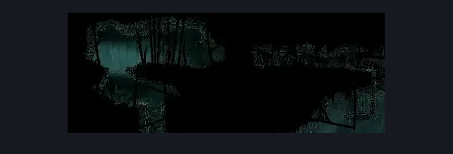

# Wisp Thicket Bench (Wisp_04)

**Game ID:** Wisp_04

**Contributors:** samupo

## Subrooms

| No. | Subroom | Annotated |
| --- | --- | --- |
| S1 | Bench |  |
| S2 | Bottom |  |
| S3 | Left |  |

- **Bench:** somehow got this duplicated or something internally

## Room Transitions

| Alias | Name | From subroom | Destination | Destination alias | Requirements | TODO | Verification | Annotated | Notes |
| --- | --- | --- | --- | --- | --- | --- | --- | --- | --- |
| L | left1 | Left | [Wisp Thicket Grounds (Wisp_02)](wisp-thicket-grounds.md) | R | none |  |  | ✓ |  |
| R | right1 | Bench | [Wisp Thicket Shaft (Wisp_08)](wisp-thicket-shaft.md) | L | none |  |  | ✓ |  |
| B | bot1 | Bottom | [Greymoor Western Tower (Greymoor_06)](../greymoor/greymoor-western-tower.md) | T | none |  |  | ✓ |  |

## Subroom Connections

| Alias | Name | Source | Destination | Requirements | TODO | Verification | Annotated | Notes |
| --- | --- | --- | --- | --- | --- | --- | --- | --- |
| L1 | Left to Bench | Left | Bench | clawline OR dash OR spike pogo OR drifter's cloak OR faydown cloak |  |  |  |  |
| L2 | Left to Bottom | Left | Bottom | spike pogo OR drifter's cloak OR clawline OR dash |  |  |  |  |
| B1 | Bench to Left | Bench | Left | (dash AND ledge grab) OR faydown cloak OR clawline |  |  |  |  |
| B2 | Bench to Bottom | Bench | Bottom | drifter's cloak OR spike pogo OR clawline OR dash |  |  |  |  |
| V1 | Bottom to Bench | Bottom | Bench | spike pogo OR (faydown cloak AND clawline) |  |  |  |  |
| V2 | Bottom to Left | Bottom | Left | spike pogo AND (ledge grab OR faydown cloak OR clawline) |  |  |  |  |

## Check Locations

| No. | Check | Subroom | Requirements | TODO | Verification | Location Type | Annotated | Notes |
| --- | --- | --- | --- | --- | --- | --- | --- | --- |
| 1 | Bench | Bench | none |  | Verified | bench |  |  |
| 2 | Craw Summons | Bench | Craw Summons Ready |  | Verified | collectible |  |  |

## Room Images

### Scene

### Connections

### Checks

