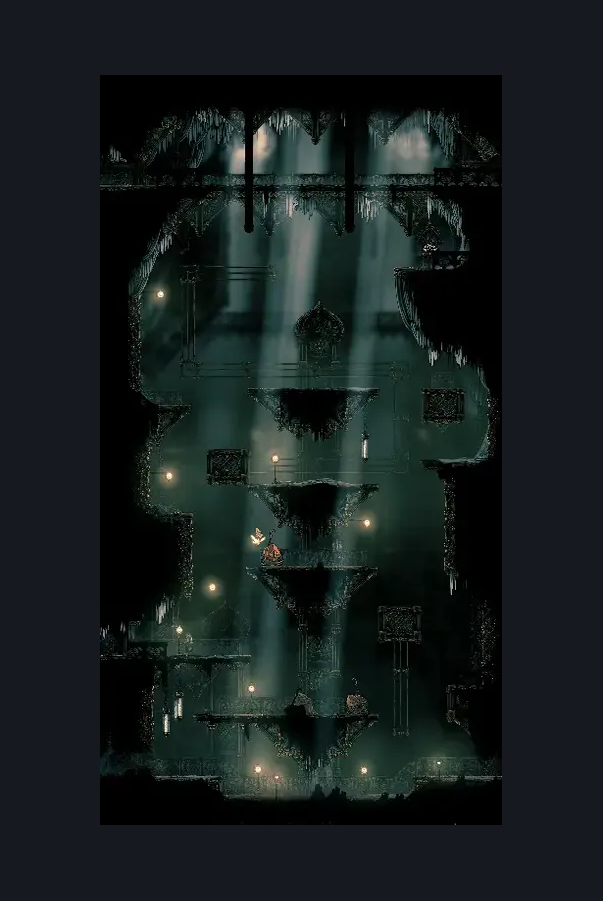
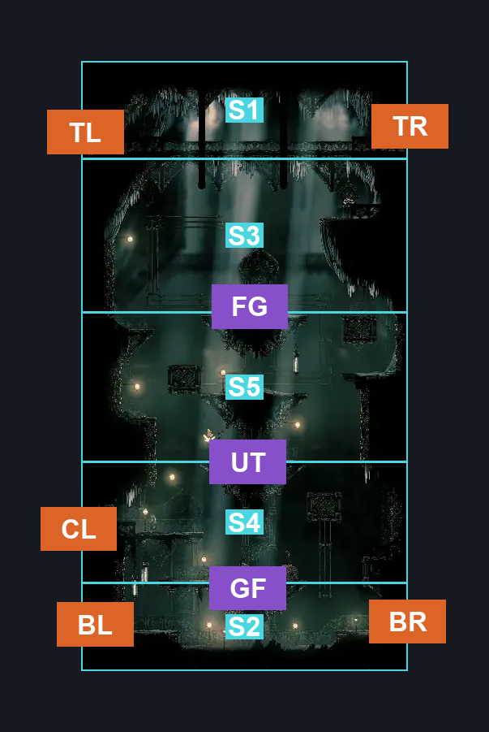
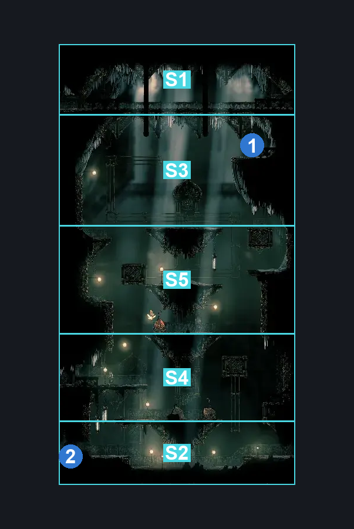

# Whispering Vaults Flea Shaft (Library_01)

**Game ID:** Library_01

**Contributors:** Rebel

## Subrooms

| No. | Subroom | Annotated |
| --- | --- | --- |
| S1 | Top | ✓ |
| S2 | Bottom | ✓ |
| S3 | Flea Check | ✓ |
| S4 | Lower Platforms | ✓ |
| S5 | Upper Platforms | ✓ |

- **Top:** Self contained.

## Room Transitions

| Alias | Name | From subroom | Destination | Destination alias | Requirements | TODO | Verification | Annotated | Notes |
| --- | --- | --- | --- | --- | --- | --- | --- | --- | --- |
| BR | right2 | Bottom | [Whispering Vaults Hell (Library_04)](whispering-vaults-hell.md) | LL | Nothing. |  | Verified | ✓ |  |
| CL | left2 | Lower Platforms | [Grand Bellway Library (Library_03)](grand-bellway-library.md) | R | Silk Soar OR (Activate Whispering Vaults: Flip Switch #5 IN whispering vaults vaultborn lever AND Easy Enemy Pogo (2)) OR (Faydown Cloak AND (Ledge Grab OR (Sprint AND (Easy Beast Crest Pogo OR Easy Shaman Crest Pogo OR Easy Needle Strike Stall (Beast))))) OR (Cling Grip AND (Easy Enemy Pogo OR Sprint OR Dash OR Clawline OR Drifter's Cloak OR Sharpdart OR Easy Beast Crest Pogo OR Easy Needle Strike Stall (Beast OR Architect))) |  | Verified | ✓ | first enemy pogo only available with flipped lever. crest specific options and enemy pogos probably easy skip? |
| TR | right1 | Top | [Whispering Vaults Hell (Library_04)](whispering-vaults-hell.md) | TL | Nothing. |  | Verified | ✓ |  |
| TL | left1 | Top | [Songclave Steam Tunnel (Library_02)](songclave-steam-tunnel.md) | BR | Nothing. |  | Verified | ✓ |  |
| BL | left3 | Bottom | [Whispering Vaults Vaultborn Lever (Library_15)](whispering-vaults-vaultborn-lever.md) | R | Activate Whispering Vaults: Break Wall #4 |  | Verified | ✓ |  |

## Subroom Connections

| Alias | Name | Source | Destination | Requirements | TODO | Verification | Annotated | Notes |
| --- | --- | --- | --- | --- | --- | --- | --- | --- |
| GF | Ground to Floor 1 | Bottom | Lower Platforms | Silk Soar OR (Faydown Cloak AND Ledge Grab) OR Enemy Pogo (Easy Skip) |  | Verified | ✓ |  |
| GF | Ground to Floor 1 | Lower Platforms | Bottom | None (Falling) |  | Verified | ✓ | added due to none all connections being one-way - hero, 9/26 |
| UT | Upwards Traversal | Lower Platforms | Upper Platforms | Silk Soar OR (Medium Enemy Pogo AND Faydown Cloak) OR (Faydown Cloak AND (Ledge Grab OR Easy Beast Crest Pogo OR Easy Needle Strike Stall (Beast) OR Easy Shaman Crest Pogo)) OR (Cling Grip AND (Sprint OR Dash OR Easy Beast Crest Pogo OR Easy Needle Strike Stall (Beast OR Architect) OR Sharpdart OR Drifter's Cloak OR Clawline)) |  | Verified | ✓ |  |
| UT | Upwards Traversal | Upper Platforms | Lower Platforms | None (Falling) |  | Verified | ✓ | added due to none all connections being one-way - hero, 9/26 |
| FG | Flea Grab | Upper Platforms | Flea Check | Silk Soar OR (Cling Grip AND (Clawline OR Sharpdart OR Drifter's Cloak OR Easy Beast Crest Pogo OR Easy Needle Strike Stall (Beast OR Architect) OR Cling Grip)) OR (Scuttlebrace AND Faydown Cloak AND Swift Step 2) |  | Verified | ✓ | collect yo flea. |
| FG | Flea Grab | Flea Check | Upper Platforms | None (Falling) |  | Verified | ✓ | added due to none all connections being one-way - hero, 9/26 |

## Check Locations

| No. | Check | Subroom | Requirements | TODO | Verification | Location Type | Annotated | Notes |
| --- | --- | --- | --- | --- | --- | --- | --- | --- |
| 1 | Whispering Vaults: Flea #1 | Flea Check | Silk Soar OR Scuttlebrace OR (Cling Grip AND (Clawline OR Sharpdart OR Drifter's Cloak OR Easy Beast Crest Pogo OR Easy Needle Strike Stall (Beast OR Architect) OR Cling Grip)) OR (Scuttlebrace AND (Faydown Cloak AND Swift Step 2)) |  | Verified | collectible | ✓ |  |
| 2 | Whispering Vaults: Break Wall #4 | Bottom | Break Wall Left |  | Verified | blockade | ✓ |  |

## Room Images

### Scene

### Connections

### Checks

