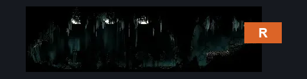
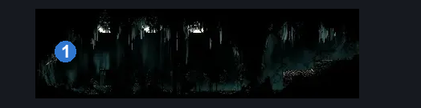
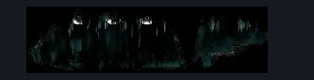

# Whispering Vaults Vaultborn Lever (Library_15)

**Game ID:** Library_15

**Contributors:** Rebel

## Subrooms

No subrooms defined.

## Room Transitions

| Alias | Name | From subroom | Destination | Destination alias | Requirements | TODO | Verification | Annotated | Notes |
| --- | --- | --- | --- | --- | --- | --- | --- | --- | --- |
| R | right1 |  | [Whispering Vaults Flea Shaft (Library_01)](whispering-vaults-flea-shaft.md) | BL | Nothing. |  | Verified | ✓ |  |

## Subroom Connections

No subroom connections defined.

## Check Locations

| No. | Check | Subroom | Requirements | TODO | Verification | Location Type | Annotated | Notes |
| --- | --- | --- | --- | --- | --- | --- | --- | --- |
| 1 | Whispering Vaults: Flip Switch #5 |  | Flip Switch Left |  | Verified | switch | ✓ |  |
| 2 | import enemies |  |  | TODO | Needs verification |  |  |  |

## Room Images

### Connections

### Checks

### Scene

